# Versioning and Publishing restrictions

This scenario shows how to manage multiple versions of the item and set publishing restrictions for specific version.

## Versioning

1. Go to the [Sitecore Launchpad](https://{{demoName}}-cm.sitecoredemo.com/sitecore/login) and log in as "superuser".
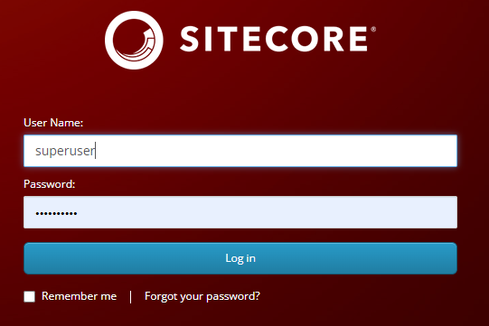

1. Click "Content Editor".
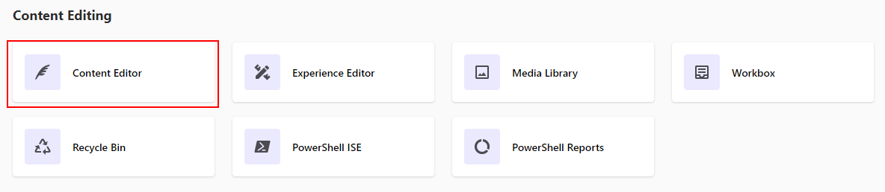

1. Expand "Home" and then "News" items.
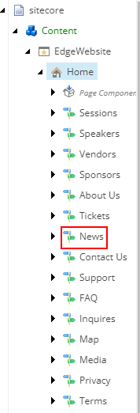

1. Open the "Get two-year access to a top fitness app" news article.
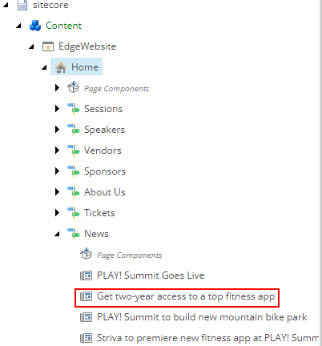

1. Click the "Versions" tab.
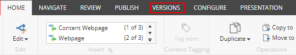

1. Click the "Add" button in the upper panel.
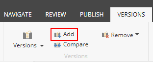

1. Change the Page Title and Title to "Limited-time promo: Get five-year access to a top fitness app".
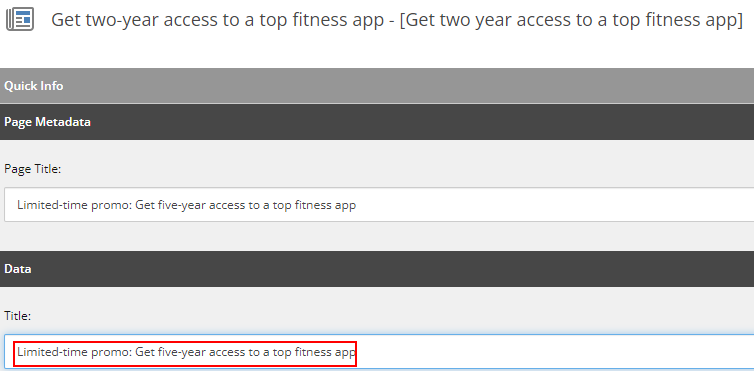

1. Click the "Save" button in the left top corner of the panel.
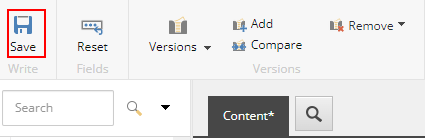

1. Click the "Compare" button in the panel.
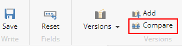

1. You will see the "Compare Versions" pop-up window, which allows you to see the difference between two versions of an item.
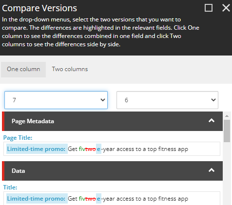

1. If you want to see the changes side by side, click the "Two columns" button.
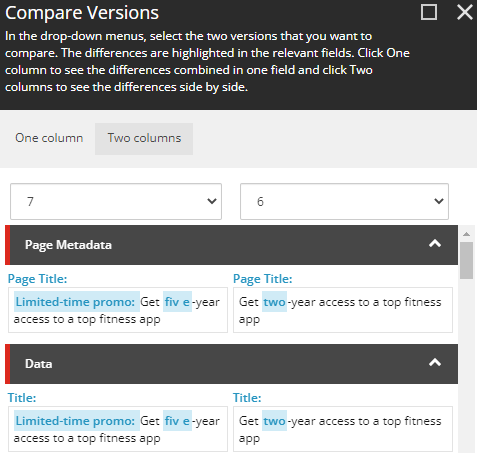

1. Then click the "OK" button to close this window.

1. Click the "Versions" tab in the ribbon and you will all available versions.
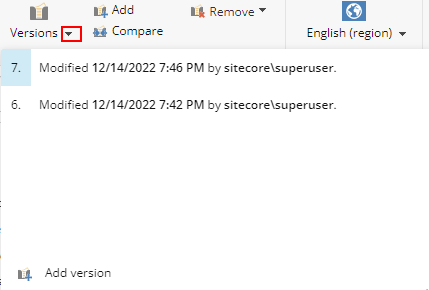

1. Go to the [PLAY! Summit Website](https://{{demoName}}-{{demoUid}}-website.vercel.app).

1. Scroll down the page and click the "News" link.
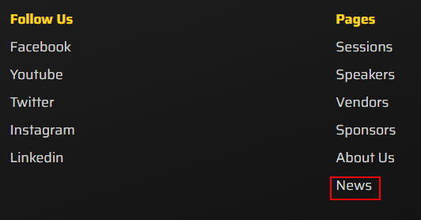

1. Note that draft versions are not displayed at the website front end.
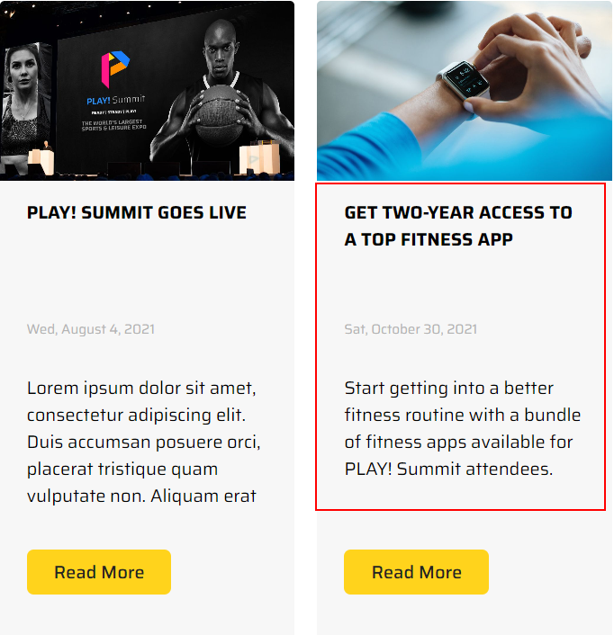

## Publishing restrictions

1. Go to the [Sitecore Launchpad](https://{{demoName}}-cm.sitecoredemo.com/sitecore).

1. Find the "Get two-year access to a top fitness app" news article in "Content Editor".

2. Click the "Publish" tab in the ribbon.

1. Click the "Change" button.
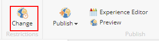

1. Set publishing settings by choosing the future date and time for the new version of the article and click the "OK" button.
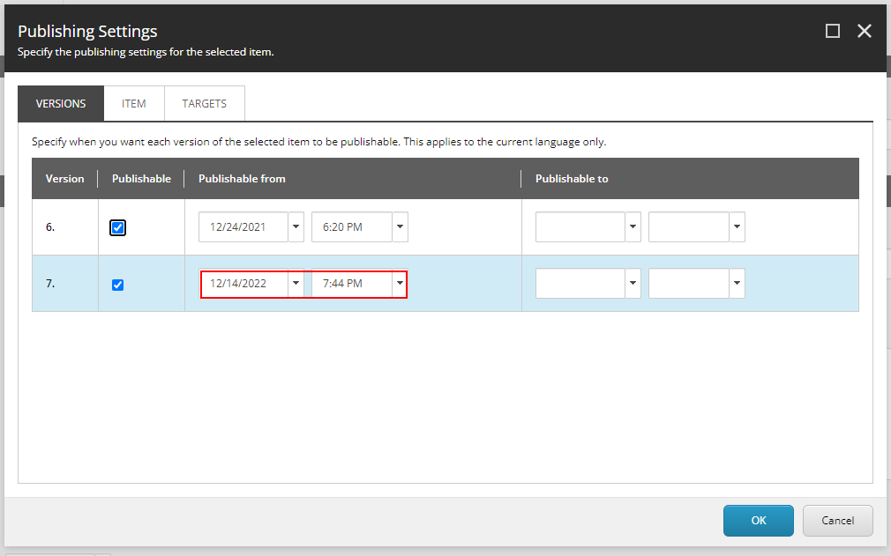

1. Open [Get two year access to a top fitness app](https://{{demoName}}-cm.sitecoredemo.com/?sc_mode=edit&sc_lang=en&sc_itemid={a2fca80d-4c97-4378-91ab-77df77be546a}&sc_ee_fb=false&sc_site=edgewebsite) item in Experience Editor.

1. You will see that initial version of the item is displayed.

1. Click the "Experience" tab.
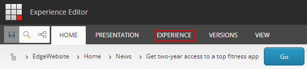

1. Set the future date and time of publication and you will see the new published article.
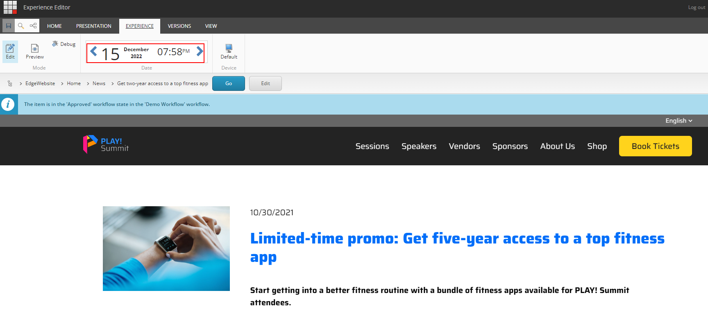

1. The page will refresh and you'll see how it will look in future.
