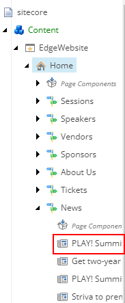
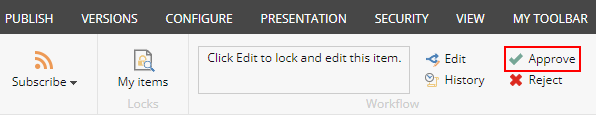

# Part 1. Introduction

1. Go to the "PLAY! Summit" website and you will see a language picker
    it the right top corner of the page.

> 

2. Navigate to the footer of the page and click "Privacy policy"
    section.

> 

3. You will see the English version by default. Switch the language
    into Canadian French by clicking the language picker in the right
    top corner of the page.

> 

4. You will see the Canadian French version of "Privacy Policy"
    section.

> 

# Part 2. Add your own language.

1. Log in to Sitecore Launchpad.

2. Go to Content Editor application.

3. Expand the "System" item in a Content Tree, click on "Languages"
    item.

> 

4. Add a new language by clicking the "Language" button.

> 

5. Choose a language in "Add a New Language" pop-up window and click
    the "Next" button a few times.

> 

6. You will see a pop-up window, that notifies you about added
    language, click the "Close" button.

> 

7. The new language item will appear under the
    /sitecore/system/languages item.

> 

8. Click the newly created item, go to the "Fallback Language" field,
    and choose English.

> 

9. Click "Save" button in the left top corner of Content Editor.

> 

10.  Return to the Sitecore Content Tree, expand the "Home" item, expand
    the "News" item, and click on "PLAY! Summit Goes Live".

> 

11. Choose your language in a language picker in the right top corner of
    the page.

> 

12.  You will see a notification that the current item does not have a
    version in your language

> 

13.  Click "Add a new version" link.

14.  Fill in the Page Title, Title, Excerpt, Content, Image fields and
    choose "Today" option in Publish Date field.

> 

15.  Click the "Save" button in the left top corner of Content Editor.

> 

16. Go to the "Review" tab.

> 

17. Click the "Submit" button.

> 

18. Skip ahead the "Enter a comment" pop-up window by clicking "OK"
    button.

> 

19. Click the "Approve" button.

> 

20. Skip ahead the "Enter a comment" pop-up window by clicking "OK"
    button.

> 

21. Return to the "PLAY! Summit" website, choose the "News" section in
    the footer of the page, click on "PLAY! Summit Goes Live".

22. Choose your language in a language picker in the right top corner of
    the page.

> 

23. You will see the updated version of your content in your language.

> 
>
> This scenario shows that you can translate your content into any
> language and publish it easily.
