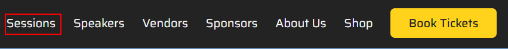
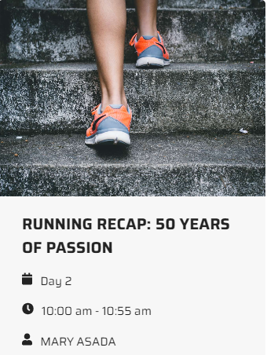

# Home Page Banner

1. Open the PLAY! Summit website in a new browsing session. 

1. You will see a random hero banner on the webpage.

    

1. Go to the Sessions page.

    

1. Click one of the sessions and choose one.

    

1. Return to the homepage and you'll see the personalized banner there.

    

1. Go to another session.

    
1. Return to the homepage and you'll see another personalized banner.

    

## This type of personalization assists us in capturing attention of our customers and engages them to make a purchase
