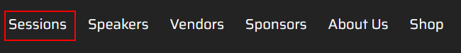
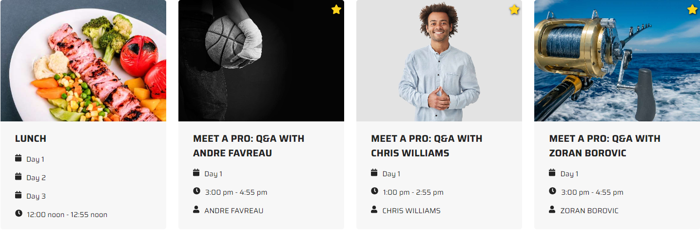
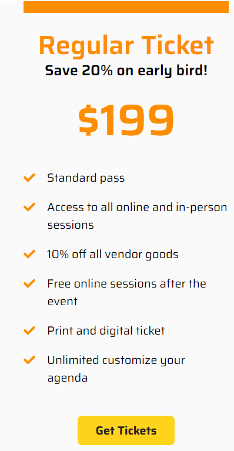
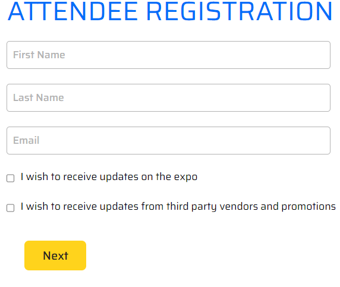
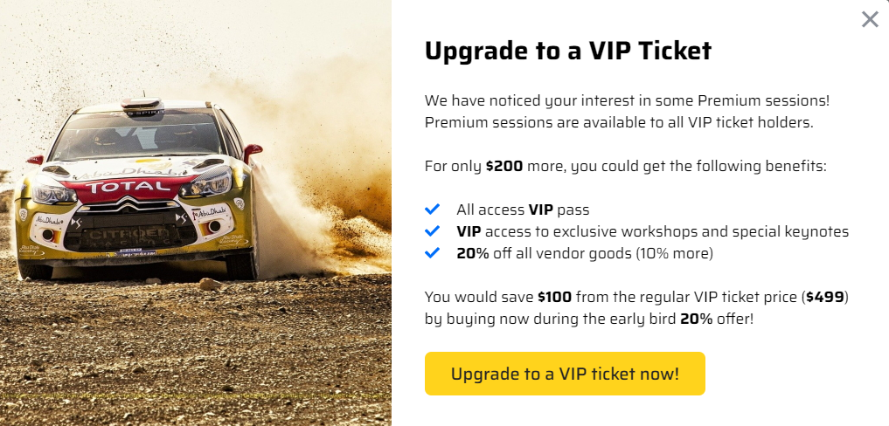

# Ticket Upsell

1. Open the PLAY! Summit website in a new browsing session. 

1. Click the section "Sessions".

    

1. Choose one of premium sessions (marked with a star icon).

    

1. Proceed to book a [Regular]{.underline} Ticket.

    

1. Submit personal information in Attendee Registration.

    

1. Before inserting the payment information, see a pop-up window, where
    you are offered to upgrade to a VIP Ticket, because you've expressed
    interest in Premium sessions.

    

## This demonstrates use of personalization for upselling during the checkout process
