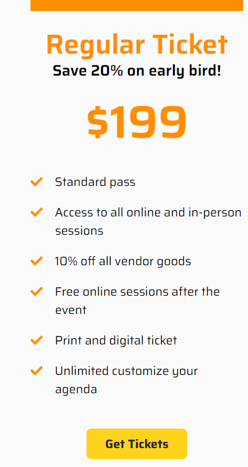
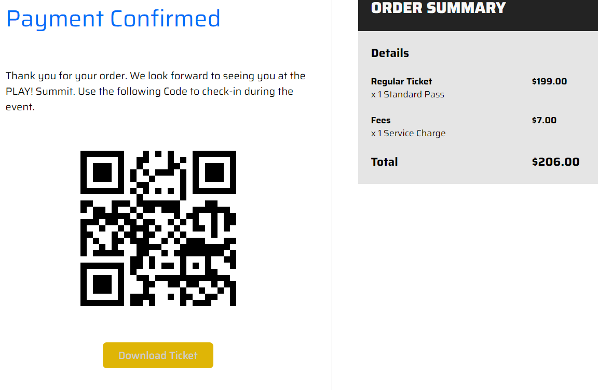
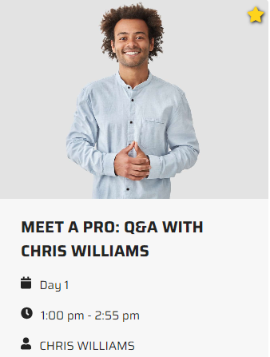
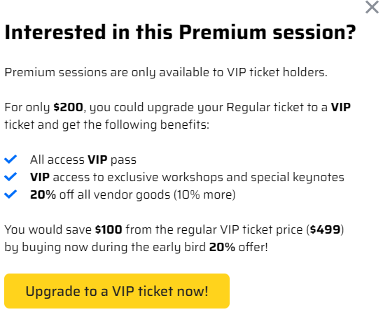

# Ticket checkout vip upsell

1. Open the PLAY! Summit website in a new browsing session. 

1. Click a button "Book Tickets".

    

1. Choose a "Regular Ticket" and confirm your purchase.

    > 

1. You will be redirected to the confirmation page.

    

1. Go to the Sessions page and visit one of the Premium Sessions
    (marked with a star icon).

    > 

1. You'll get a pop-up window, encouraging you to purchase a VIP
    ticket:

    

## This demonstrates that all actions performed by the visitor are tracked and can be used for upselling or other purposes within the current session
