# Multichannel Upsell

This scenario shows how Sitecore allows to upsell products across multiple channels to reach as many potential customers as possible.

1. Go to [PLAY! Summit Kiosk](https://{{demoName}}-{{demoUid}}-kiosks.vercel.app)

1. Click "Get Started".

1. Click "Explore the event".
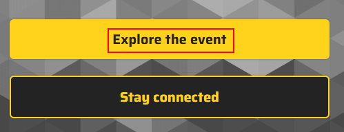

1. Choose any session, click on it.
 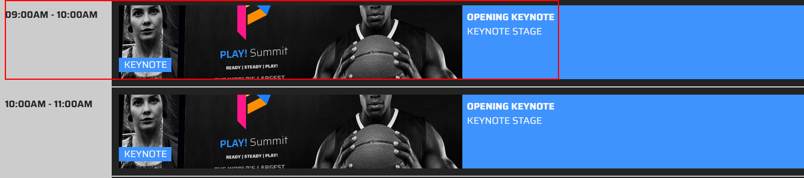

1. Click "Book tickets".
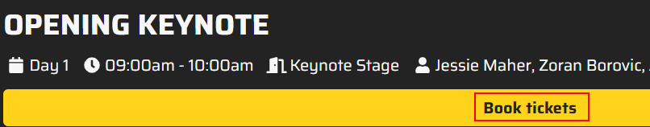

1. Choose a "Regular Ticket".
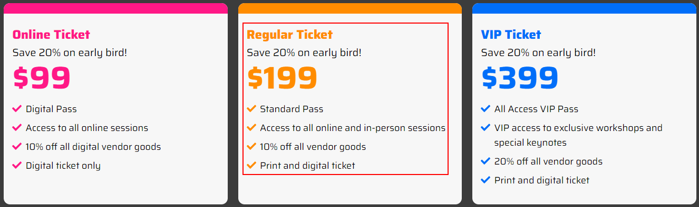

1. Click "Continue".
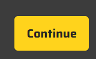

1. Enter your payment details and click "PAY NOW".
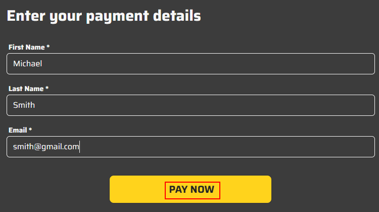

1. Click the QR code (link will be copied to clipboard).
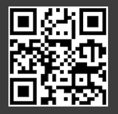

1. Click the "End Session" button.
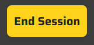

1. Go to the [PLAY! Summit Website](https://{{demoName}}-{{demoUid}}-website.vercel.app) in incognito mode, pasting the copied link.

1. Go to the "Sessions" section.
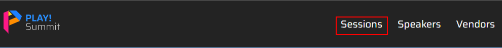

1. Scroll down the page and choose a premium session (marked with a star).
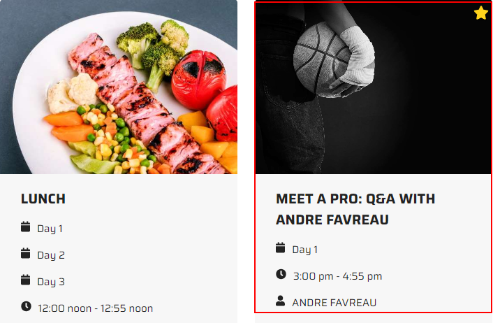

1. You will see a pop-up window, that encourages you to upgrade your ticket to a VIP ticket.
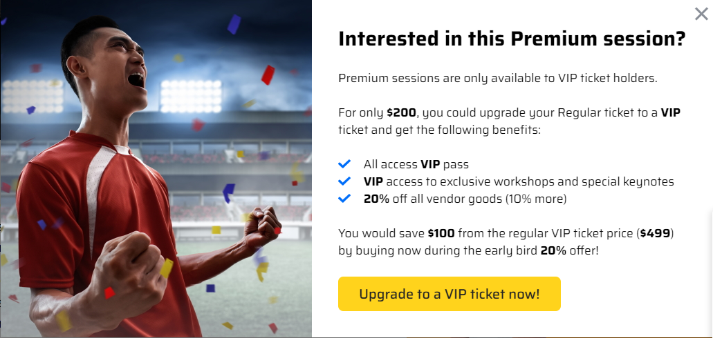
