1. Log in to your PLAY! Summit demo instance.
2. Click the "TV" link.
> 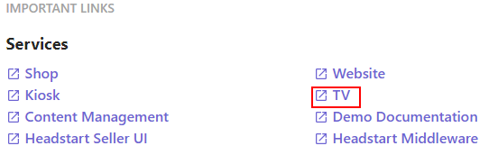

3. Choose one of the sessions.
> 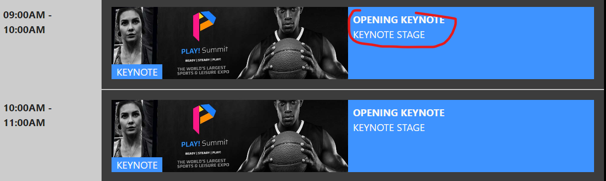

4. You will see 2 QR-codes in the lower corners of the TV-screen.
> 

5. You can scan QR-code either by your phone or by clicking QR-code link.
6. Let's click the QR-code and copy its link.
> 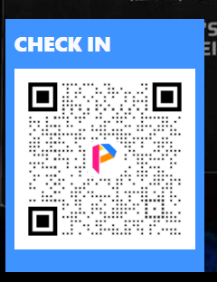

7. Open the QR-code link in incognito mode to simulate the opening on a new device.
> 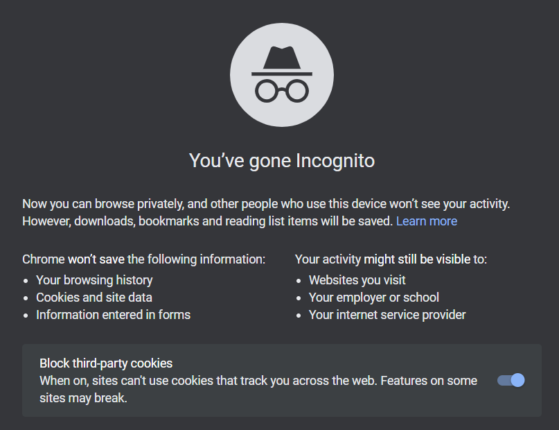

8. You will see the description of the session. Click the "Guest Data" icon on the right.
> 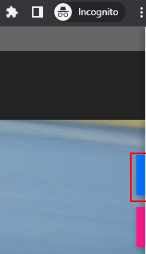

9. Click the arrow in the "web open session" field.
> 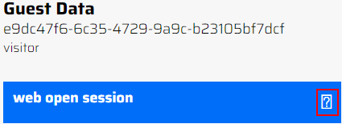

10. You will see guest data there.
> 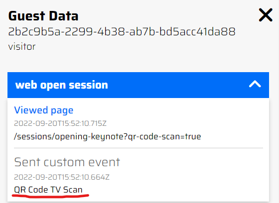

11. If you have an access to Sitecore CDP, go to app-us.boxever.com, log in
> 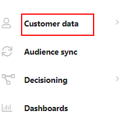 and click the "Customer Data" link.

12. Click "Guests" link.
> 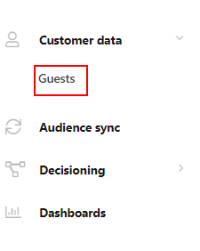

13. Switch the "Guest Type" field on the right to "All" option.
> 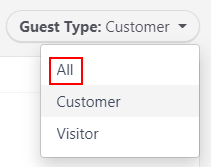

14. You will see the list of visitors.
> 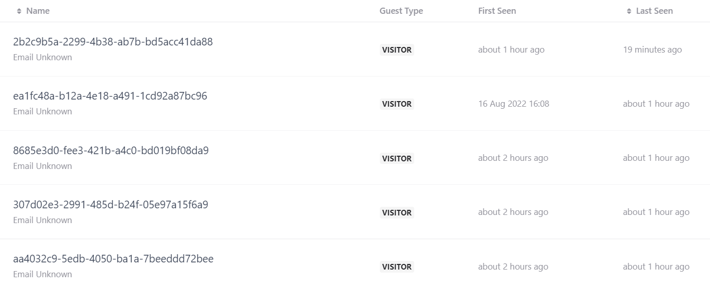

15. Click the first name and you will see visitor's activity in the "Overview" tab.
> 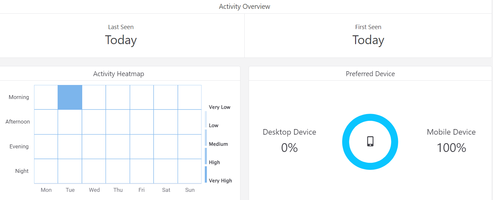

16. Open the "Timeline" tab.
> 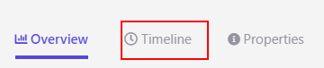

17. You will see the information about browsed session there. Click the "View Session Details" link at the bottom of this section.
> 

18. The "Events for Session" pop-up window will appear.
> 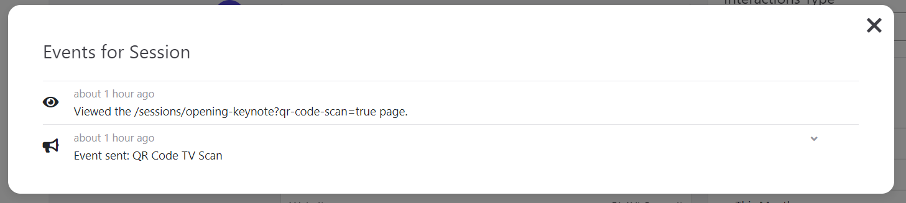

This scenario shows how CDP can easily collect visitor's information via multiple channels.
 