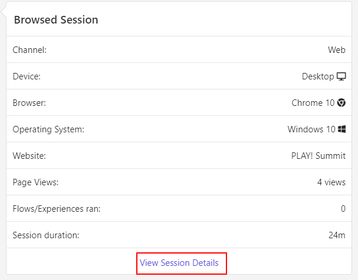

# QR Code Tracking

1. Go to [PLAY! Summit TV](https://{{demoName}}-{{demoUid}}-tv.vercel.app)

1. Choose one of the sessions.

1. You will see 2 QR-codes in the lower corners of the TV-screen.

1. You can scan QR-code either by your phone or by clicking QR-code link. Let's click the QR-code and copy its link.

1. Open the QR-code link in incognito mode to simulate the opening on a new device.

1. You will see the description of the session. Click the "Guest Data" icon on the right.

1. Click the arrow in the "web open session" field.

1. You will see guest data there.

1. If you have an access to Sitecore CDP, go to app-us.boxever.com, log in and click the "Customer Data" link.

1. Click "Guests" link.

1. Switch the "Guest Type" field on the right to "All" option.

1. You will see the list of visitors.

1. Click the first name and you will see visitor's activity in the "Overview" tab.

1. Open the "Timeline" tab.

1. You will see the information about browsed session there. Click the "View Session Details" link at the bottom of this section.

1. The "Events for Session" pop-up window will appear.

This scenario shows how CDP can easily collect visitor's information via multiple channels.
