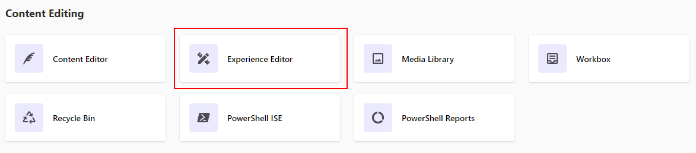
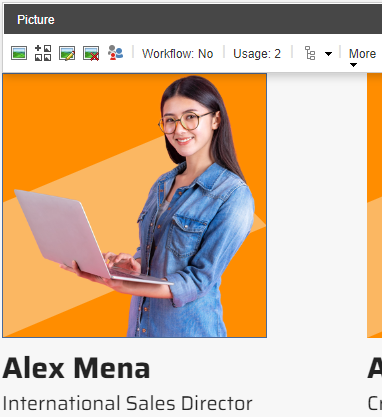
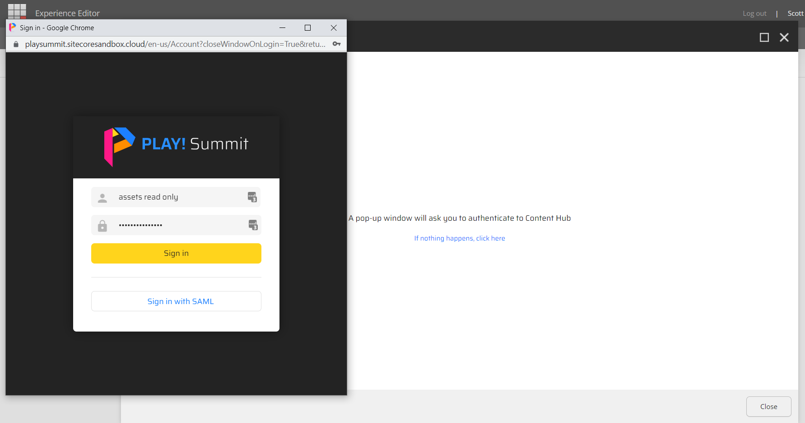
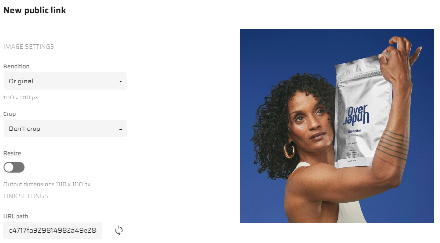
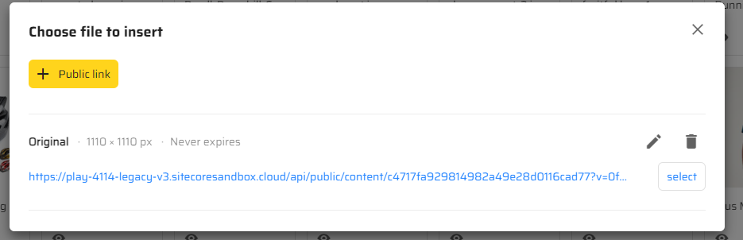

# Selecting DAM Assets in Sitecore XM

1. Go to [Sitecore Launchpad](https://{{demoName}}-cm.sitecoredemo.com/sitecore).

1. Click on the "Experience Editor" application.

1. Scroll down to the "Speaker Line-up" section at the home page, click on one of the speakers.

1. Click on the icon to open the DAM image dialog.

1. If not already logged into Content Hub DAM, click on the **"If nothing happens, clikc here"** link in the popup window.

1. The Sitecore XM demo site is connected to a shared instance of Sitecore Content Hub DAM. You can log into the shared Content Hub DAM instance with read-only access using one of the following login methods.

- **Sign in with SAML** - Use your Sitecore single sign-on account
- **Sign in with standard login** - Use the following user credentials
  - **username**: assets read only
  - **password**: v36Gvd7FVY3M9M7

1. Select the image you want from Sitecore DAM.

1. Create a new public link or select an existing public link.

1. Click the "Select" button in the "Choose file to insert" pop-up window.

1. You will see a new image in the "Speaker Line-up" section.

> This scenario shows how to use images from Sitecore Content Hub in Sitecore XM.
