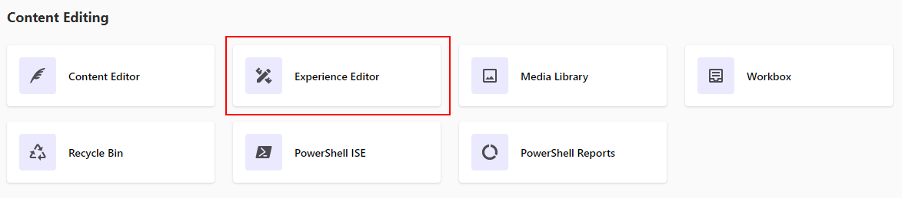
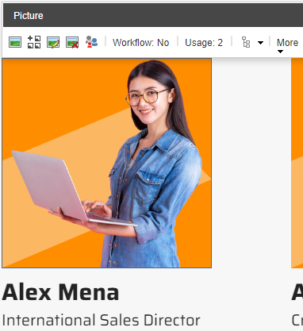

# Selecting DAM Assets in Sitecore XM

1. Go to Sitecore Launchpad.

1. Click on the "Experience Editor" application.

1. Scroll down to the "Speaker Line-up" section at the home page, click on one of the speakers.

1. Choose DAM image.

1. Select the image you want from Sitecore DAM.

1. Click the "Save" button.

1. Click the "Select" button in a "Choose file to insert" pop-up window.

1. You will see a new image in a "Speaker Line-up" section.

> This scenario shows how to use images from Sitecore Content Hub in Sitecore XM.
