# Create once, publish everywhere

1. Go to your instance details page at
    <https://portal.sitecoredemo.com/instance/{{demoId}}>.

1. Click "Instance Url" in the Content Hub section.

1. You will see the Sitecore Content Hub homepage.

1. Click the "Summit" drop-down menu and then click "Sessions".
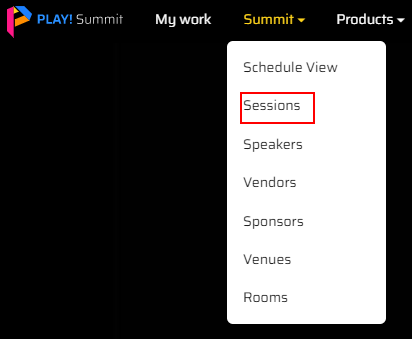

1. Find the session that you want to update, for instance, the "Breakfast" session.
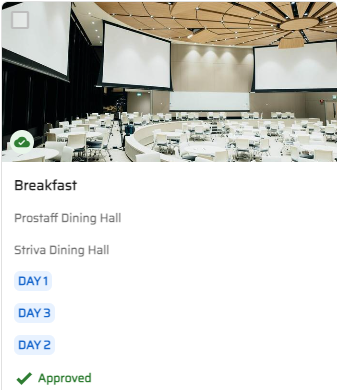

1. Change the Title of the session by clicking the Edit icon in the right corner of Detail window.
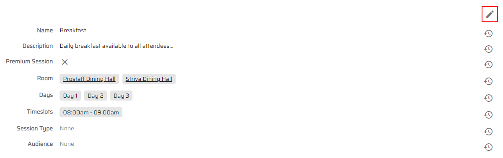

1. Click the "Save" button.
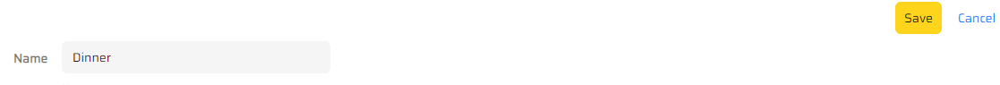

1. Click the "Re-publish session" button in the right top corner of the pane.
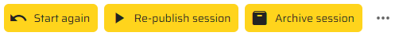

1. Approve this session by clicking the "Confirm" button in a pop-up window.
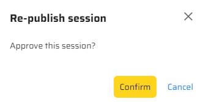

1. You will see the notification under the session image that session content has been approved.
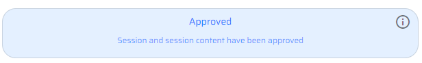

1. Return to the details page of your instance and click the "Kiosk" link.
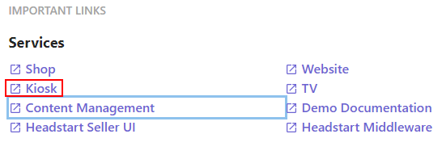

1. Click the screen with Play! Summit hero image.

1. Click the "Explore the event" button.
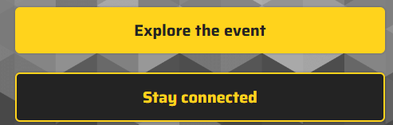

1. Reload the page.

1. You will see the updated name of session.
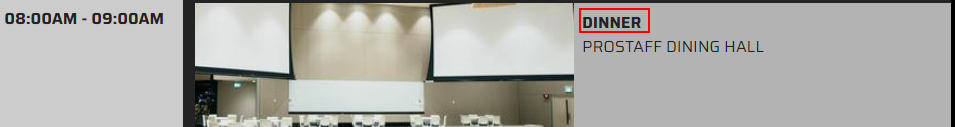

1. Return to the details page of your instance and click the "TV" link.
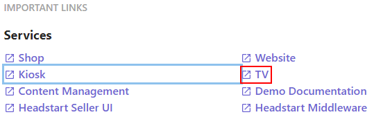

1. You will see the updated title of session here as well.
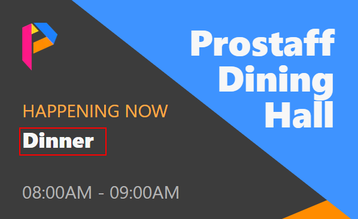

1. Return to the details page of your instance and click the "Website" link.
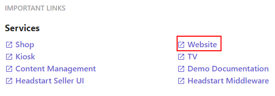

1. Click the "Sessions" section.

1. Scroll down to explore sessions.

1. Reload the page and you will see the updated name of your session there also.
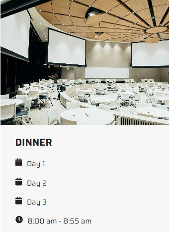

> This scenario shows how the content can be updated in one place and
> published across multiple channels easily.
