# Publishing content and asset images from Content Hub to Sitecore XM.

1. Login to your Content Hub demo instance.

1. Click the "Content" item.

1. Click the "Search" item.

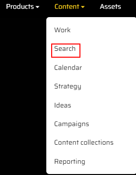

1. You will see the "News" item in the "Content Type" section in the left side pane, click on it.
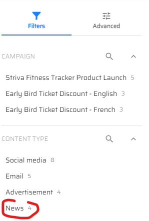

1. We have 4 news articles, and we will create a new one. Click on the "Add Content" button in the right top corner of the page.
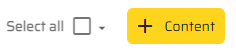

1. Fill in the "Name" field, add type "News" in the "Content" pop-up window.
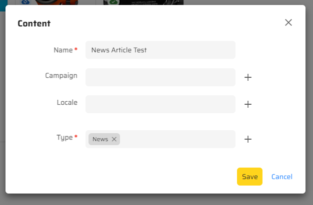

1. Click the "Save" button.

1. You will see a blank page, click the "Edit" button.
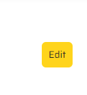

1. Fill in the Title, Excerpt, Content fields.
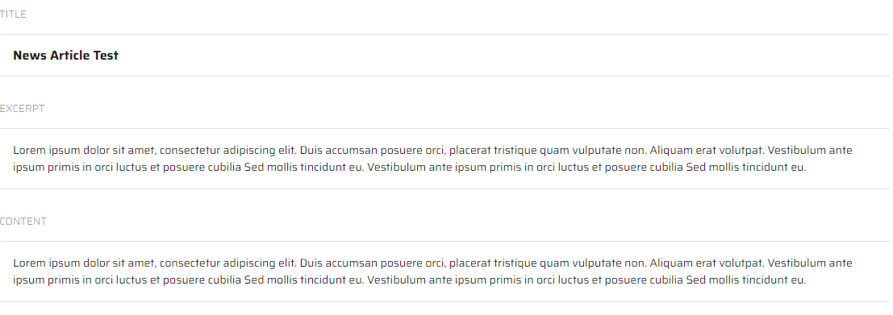

1. Click the "Save" button.
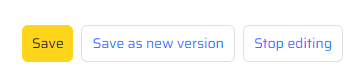

1. Add a new image by clicking the "Add" button under the "Content"
    field, choose "Add existing items" option.
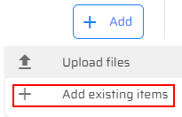

1. Choose an existing item.
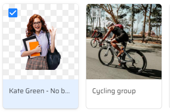

1.  Click the "Add" button at the bottom of "Add existing items" window.
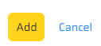

1. Click the "More actions" button to set this image as cover one in case you have a couple of images.
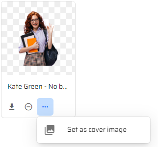

1. Click "OK" button in "Set as cover image" pop-up window.

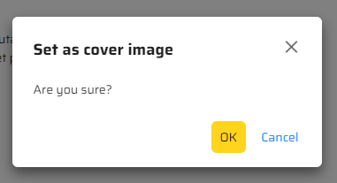

1. Choose the "Details" tab on the right-hand side of page.
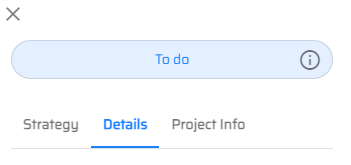

1. Click the Edit icon.
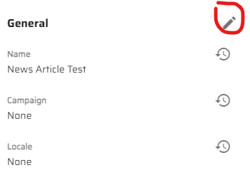

1. Choose the date you want your article to be published on by clicking the Calendar icon.
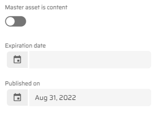

1. Click the "Save" button under the "Project Info" tab.

1. Click the "Start" button in the right top corner of the page to publish it.
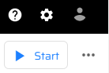

1. Click the "Send for review" button in the right top corner of the page.

1. Click the "Approve" button in the right top corner of the page.

1. Click the "Confirm" button in "Approve" pop-up window.
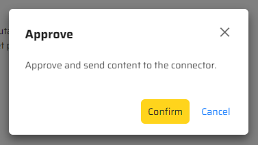

1. Go to Sitecore Launchpad.

1. Open the following item in a Content Editor: **/sitecore/content/EdgeWebsite/home/news**, you will see a new article.

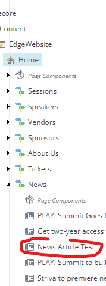

> This scenario shows that you can publish content from Content Hub to
> Sitecore XM.
