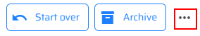
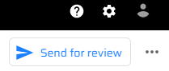

# Content Localization in Content Hub

1. Log in to your Content Hub instance.

1. Click the Content link.

1. Click the drop-down menu and choose "Search" link.

1. Click the "News" link in the left-side panel.

1. You will see 4 news articles.

1. Click on one, for instance "PLAY! Summit to build new mountain bike park".

1. You need to indicate the language of existing content and mark it as "English" in "Locale" window in the right-side bar by clicking the Edit button.

1. Click the "Add" button near the "Locale" row.

1. Choose the "English" item in the list of languages.

1. Click the "OK" button and then click the "Save" button.

1. You will see the selected language in the right-side bar.

1. To translate your content, click the "More actions" button in the right top corner of the page.

1. Click the "Localize" link in the drop-down menu.

1. You will see a "Localize" pop-up window, where you should fill in "Name" and "Locale" fields.

1. Click the "Create" button.

1. You will see the updated content in your news article.

1. To push your content to Sitecore XM, click the "Submit" button in the right top corner of the page.

1. Click the "Approve" button.

1. Click the "Start" button.

1. Click the "Send for review" button.

1. Click the "Approve" button and you will see the "Approve" pop-up
    window.

1. Click the "Confirm" button to approve and send content to the connector.

1. Go to the Launchpad Sitecore.

1. Click the Content Editor tile.

1. Go to "Home" and then, to the "News" sections in the left-side bar.

1. Find the "PLAY! Summit to build new mountain bike park" article in the drop-down menu.

1. Click the "German" in the right-top corner of the "Content" window to see the translated version of your article.

1. You will see the updated content in Sitecore XM as well.

> This scenario shows how you can easily translate your content and
> publish it in Sitecore XM.
