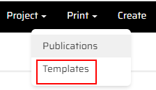
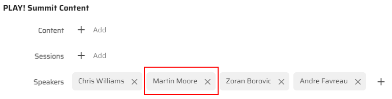
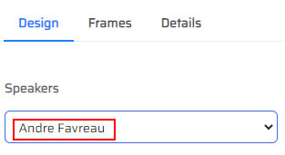
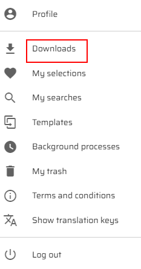

# Print functionality in Content Hub

1. Log in to your Content Hub instance.
2. Click the "Print" section in the main menu.
> 

3. Click the "Templates" link.
> 

4. You will see 4 templates in the "Templates" list. Click the "ID Badge Template".
> 
> 
4. You can add more speakers by clicking the "Edit" button in the "PLAY! Summit Content" subsection of the "Details" section.
> 

5. Click the "Add" button near the "Speakers" field.
> 

6. Choose the speaker in the "Speakers" pop-up window and click the "OK" button.
> 
> 
7. Click the "Yes" button in the "Confirm" pop-up window.
> 

8. You will see the added speaker in the "Speakers" field.
> 

9. Click the "Save" button.
> 

10. Click the "Edit template" button in the right-top corner of the page.
>

11. You will see the banner of chosen template and you can change the "Speakers" or "Speaker Type" fields in the "Design" section.
> 

12. Choose another speaker in the "Speakers" field.
> 

13. You will see the photo of the selected speaker.
> 

14. Click the "Save" button and then the "Download" button.
> 

15. Choose the "PDF" format from the list.
> 

16. Click the "Profile and settings" icon and choose the "Downloads" option.
> 

17. You downloaded the new template to your "Downloads" folder.
> 

18. Return to the "Print" section, choose the "Publications" subsection.
> 

19. You can also add publication by clicking the "Add Publication" button in the right-top corner of the page.
> 

20. Choose a template from the "Choose template" list and design it.
> 
> 

This scenario shows how you can use the ready templates, edit them in preffered way and add new publications in Content Hub.

