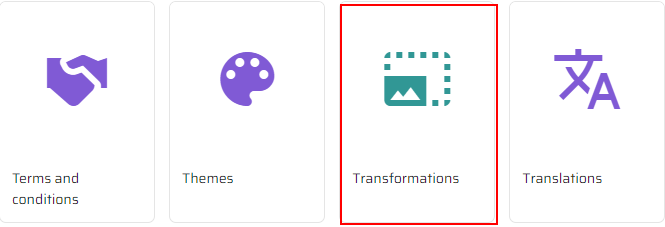
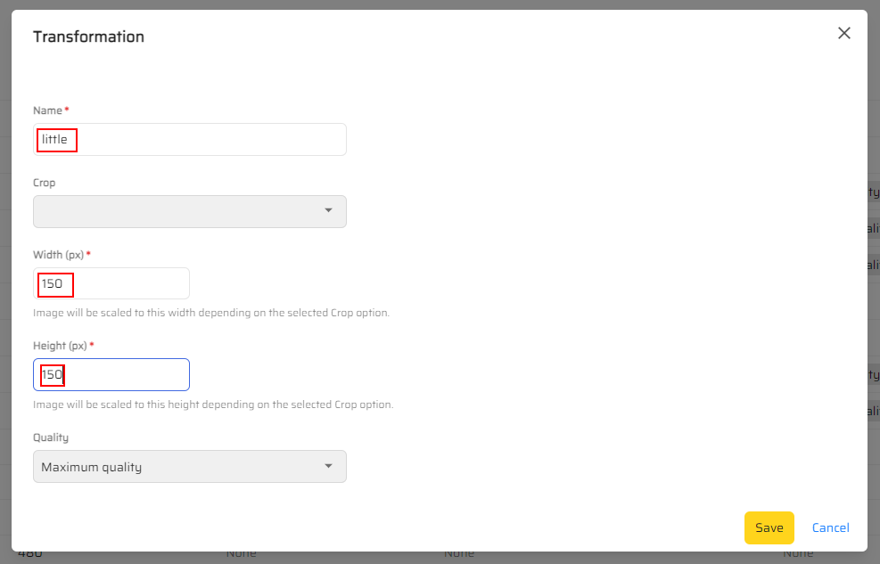
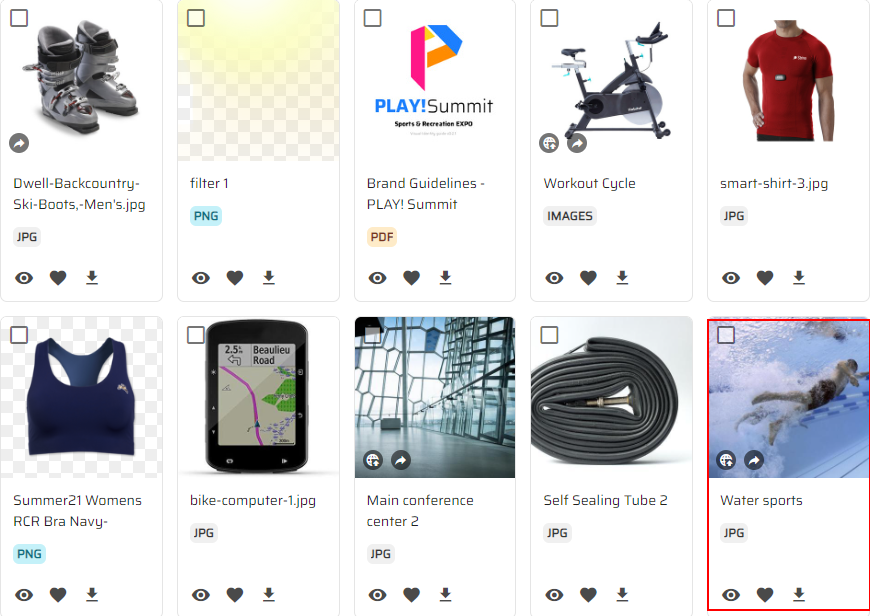
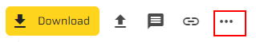
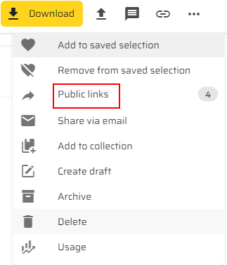
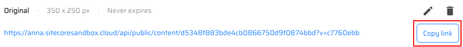
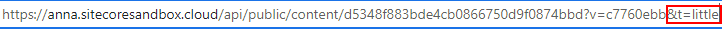
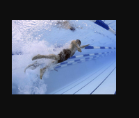

# Creating and managing transformations

This scenario shows how you can serve the same asset in different dimensions by using transforms in Content Hub DAM.

1. Go to your Content Hub instance.

1. Click the "Manage" icon in the right top corner of the page.

1. Scroll down the page and click the "Transformations" item.

1. Click the "Add Transformation" button in the right top corner of the screen.

1. You will see the "Transformation" pop-up window. Fill in the "Name", "Width", "Height" fields and click the "Save" button.

1. Click the "Assets" section.

1. Click any asset in the list.

1. Click the "More actions" button under the "Profile and settings" icon.

1. Click the "Public links" item in the list.

1. Click the "Copy link" button in the "Public links" pop-up window.

1. Open the new tab in the browser.

1. Paste the copied link into the searchbox and add "&t=little" and press Enter.

1. You will see the transformed image.

