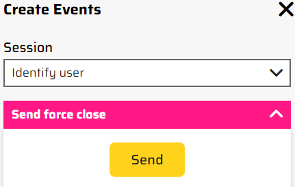

# Session browse abandonment

1. Open the [PLAY! Summit Website](https://{{demoName}}-{{demoUid}}-website.vercel.app) in a new browsing session.

1. Click the button "Book Tickets" and you'll see available ticket tiers.

1. Click the button "Get tickets" on any ticket and you'll see an Attendee Registration form.

1. Fill out your First Name, Last Name and Email, click the "Next" button, but don't complete Payment information section.

1. Click the pink button in the side bar on the right of the screen.

1. Choose "Send force close".

1. Close a browsing session by clicking the "Send" button.

1. You'll receive an email that encourages you to complete your purchase.

This helps to re-engage customers, reminding about their unfinished purchases.
