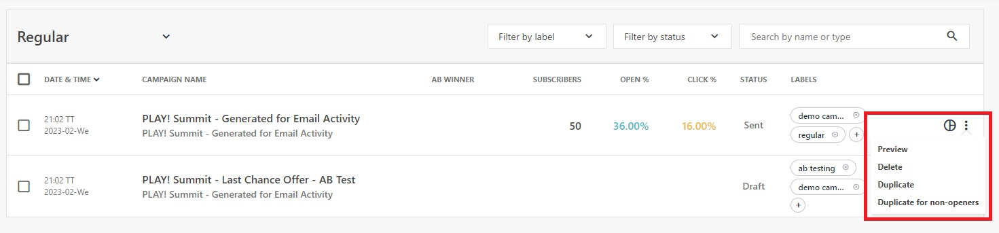
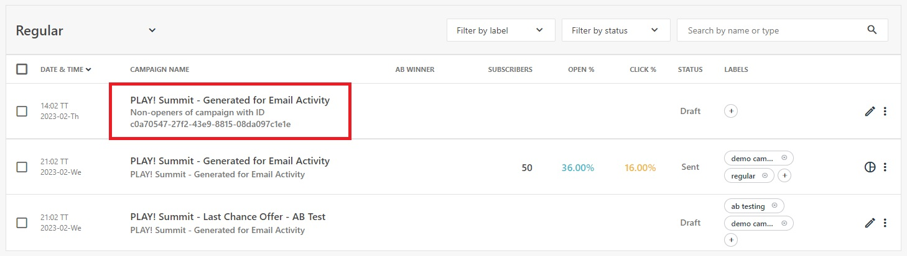
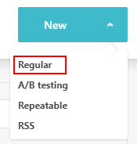
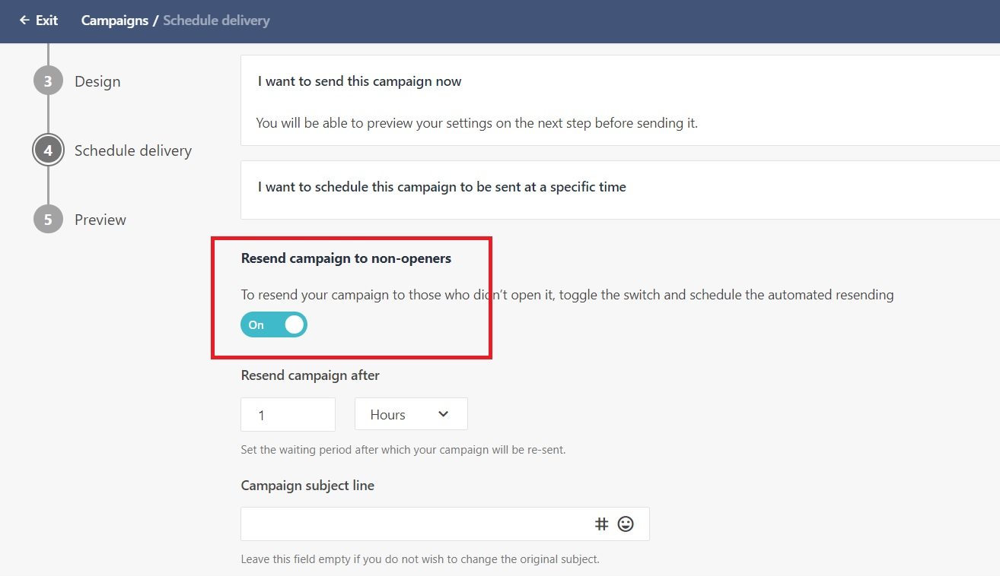

# Duplicate Campaign for Non-openers

This scenario will demostrate how to configure a campaign to be manually or automatically resent to contacts who did not open a previosuly sent campaign.

## Manually Duplicate for Non-openers

1. Go to <https://sitecoresendemo.sitecoresend.io/campaigns/list/Regular/1> and find the campaign named **"PLAY! Summit - Generated for Email Activity"**. This campaign has been pre-sent and collected some basic open/click statistics.

1. Hover over the vertical ellipsis beside this campaign and select the "Duplicate for non-openers" option in the popup.

1. A new campaign will be created that has a sub-heading "Non-openers of campaign with ID". Click on the newly created campaign.

1. The new campaign is preconfigured and ready to send to all list members who did not open the previous email campaign. You can update any of the campaign settings (subject line, etc.) or design before sending.

## Automatically Duplicate for Non-openers

1. You have the option to configure a campaign to automatically re-send to non-openers after a set period of time when creating a new campaign.

1. Go to <https://sitecoresendemo.sitecoresend.io/mailing-lists-new/list/mailing-lists/1> and Click **"New"** -> **"Regular"** to create a regular email campaign.

1. Complete step 1 (Set basic settings) for the email campaign and click the "Next >" button to save your changes. Next, click on step 4 (Schedule delivery). You can optionally turn on the **"Resend campaign to non-openers"** option and configure as needed.

This approach makes it easy to resend to non-openers during the setup of the original email campaign.
