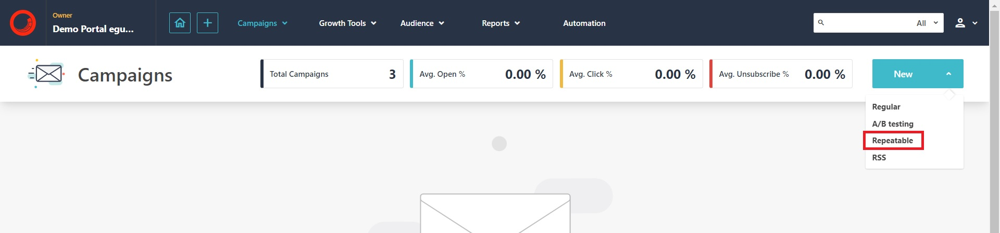
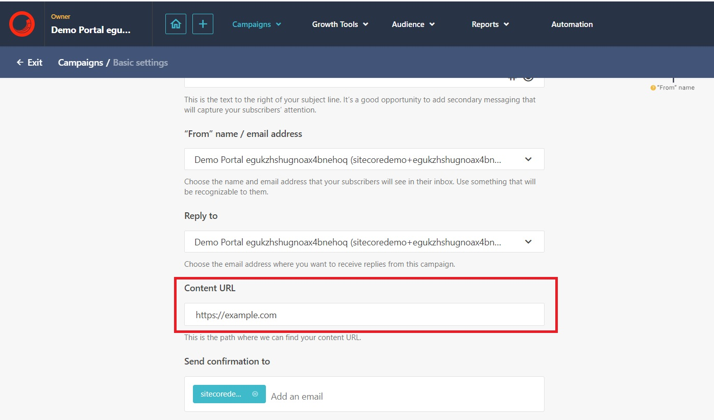
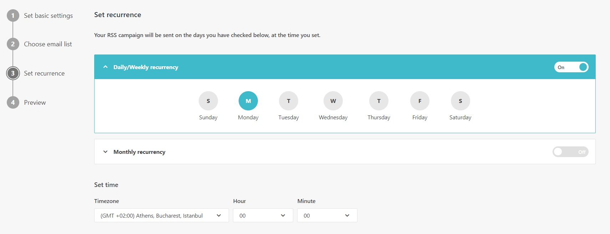

# Create a Repeatable Campaign

This scenario will demonstrate how to configure a repeatable email campaign that pulls content from an external source and sends at a pre-scheduled date and time.

1. Go to <https://sitecoresendemo.sitecoresend.io/campaigns/list/Digest/1> and click click **"New"** -> **"Repeatable"**.

1. Complete step 1 (Set basic setting). Repeatable emails have an additional field named **"Content URL"** that is used to point to a source of data for the repeatable campaign. The concept is that the external URL can be updated and the repeatable campaign will pull new content when sending. For this demo example, you can use **"https://example.com"** as the external content URL.

1. Select an existing email list or create a new one with your email. You can select the list named **"PLAY! Summit - Generated for Email Activity"** which will generate some basic analytics.

1. Step 3 (Set recurrence) will define the scheduled date and time used to send the campaign. There are weekly/monthly date settings that can be configured.

1. Finally, you can preview and start the campaign. The repeatable campaign will not send until the scheduled date and time. Please note that emails will continue to be sent as defined in the schedule. It is best to turn off a repeatable campaign when it is not intended to be in use.

This example demonstrates the basic concepts of a repeatable campaign and will allow you to get up and running with sample content. You can update the **"Content URL"** in the settings to experiment with different content.
