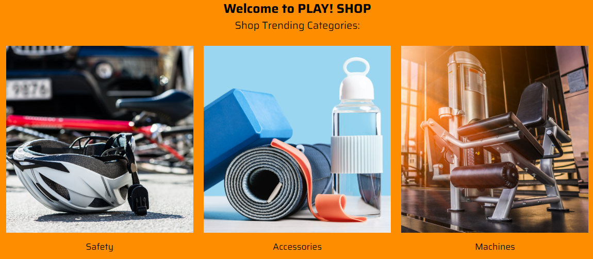
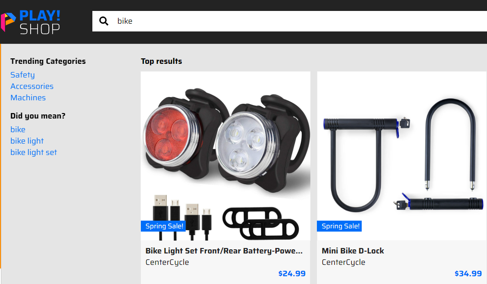
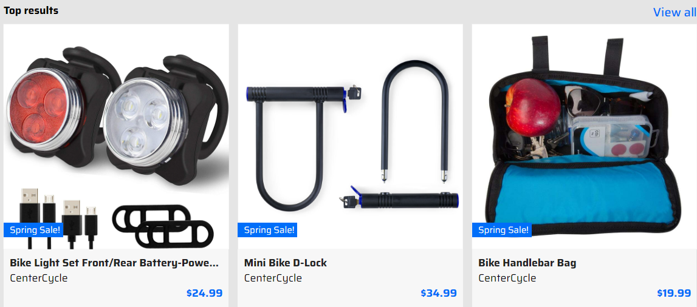
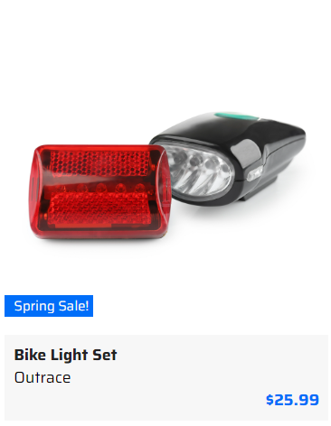
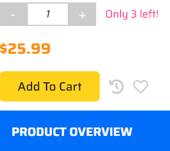
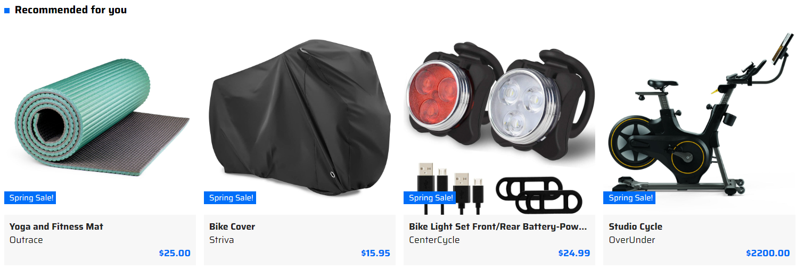
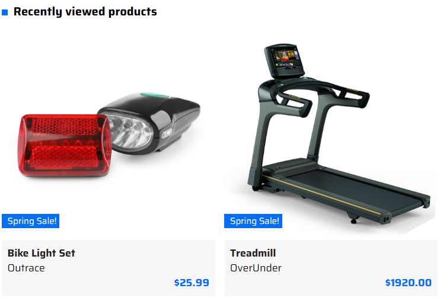

# Product Discovery Overview

This describes the Sitecore Discover functionality available on the front-end of PLAY! SHOP.

1. Go to "Play! Shop" website.

1. You will see different Shop Trending Categories there and recommended products for you by default.

1. Click the search bar and you will see top results based on trending categories located in the left pane.

1. Enter the name of the item you are interested in to the search bar and you will see available search options.

Note that there are related query suggestions in the left pane under "Did you mean?" section.

1. You can explore all products related to your search by clicking the "View all" link in the right corner of the page.

1. Scroll down and choose "Bike light set" product.

1. Click the "Add To Cart" button.

1. Return to the homepage and you will see updated recommended products for you based on your intention to purchase a similar product.

This demonstrates that after you expressed your interest in bikes, you see bike-related accessories in the recommended products section based on it.

1. Click the shopping cart icon in the right top corner of your page and you will see an unfinished purchase there.

1. Click the "View full cart" button.

1. You will see your chosen item there, recommended products for you, prompting you to add another purchase to your cart and recently viewed products.

