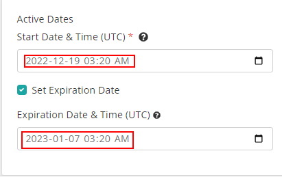
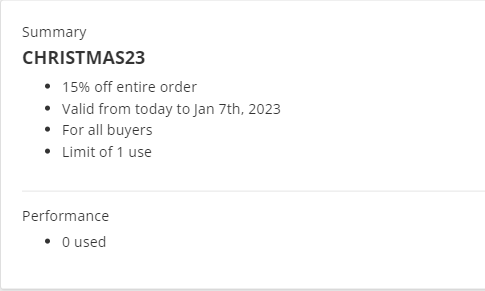
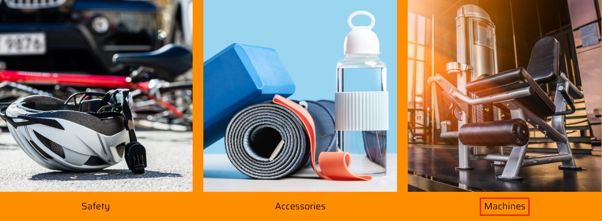
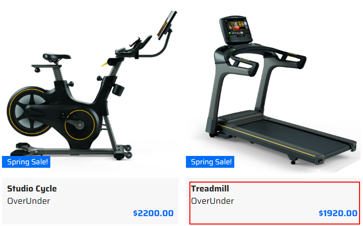
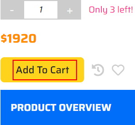
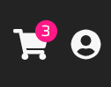
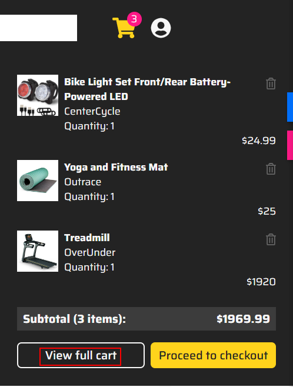
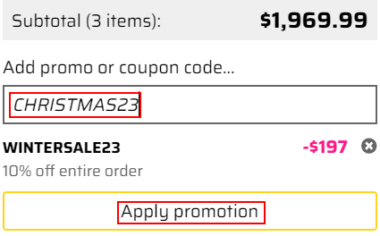
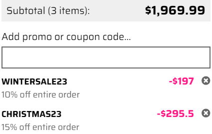

# Creating and using promo codes

This scenario shows flexibility of the promotion codes management process using Sitecore OrderCloud platform.

1. Go to your instance details page <https://portal.sitecoredemo.com/instance/{{demoId}}>.

1. Copy password of the "Headstart Admin" user.

1. Click the "Headstart Seller UI" service.

1. Log in as "superuser" and click the "Submit" button.

1. Click the "Products" section in the menu bar.

1. Click the "Promotions" link.

1. Click the "Create New Promotion" button in the left top corner of the page.

1. Fill in the "Discount Code".

1. Mark the "Type" field, fill in the "Value" field and set minimum requirements for promotion.

1. Scroll down the page and also fill in the "Usage Limits" and "Active Dates" fields. Note, that "Start Date" should be today.

1. Fill in the "Set Expiration Date" field and click the "Create" button.

1. You will see the "Summary" window.

1. Create one more promotion by clicking the "Create New Promotion" button.

1. Fill in the "Discount Code" field.

1. Fill in the "Type", "Value", "Applies to" and "Minimum Requirements" fields.

1. Fill in the "Buyer Eligibility" and "Usage Limits" fields.

1. Fill in the "Active Dates" field.

1. You will see the summary. Click the "Create" button.

1. Click the "Shop" service in your instance.

1. Choose the interested shop trending category.

1. Choose the interested item.

1. Click the "Add To Cart" button under the price.

1. Click the "Cart" icon in the right top corner of the page.

1. Click the "View full cart" button.

1. Add promo code.

1. Click the "Apply promotion" button.

1. You will see the percentage of your discount.

1. Click the "Proceed to Checkout" button to complete your purchase.

1. Return to the PLAY! Shop home page.
1. Choose the interested shop trending category.

1. Click the interested item.

1. Click the "Add To Cart" button under the price.

1. Click the "Cart" icon.

1. Click the "View full cart" button.

1. Add another promo code.

1. Click the "Apply promotion" button.

1. You will see that your promo code didn't apply, because the total amount of your order is less than 100$, as it was indicated in this promo.

1. Return to the PLAY! Shop home page.
1. Choose the interested shop trending category.

1. Choose the interested item.

1. Click the "Add To Cart" button under the price.

1. Click the "Cart" icon in the right top corner of the page.

1. Click the "View full cart" button.

1. Add the second promo code and click the "Apply promotion" button.

1. You will see the applied promo codes. You can delete one of them clicking the "Delete" button and proceed to checkout.

