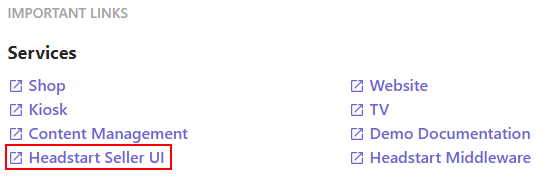
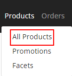
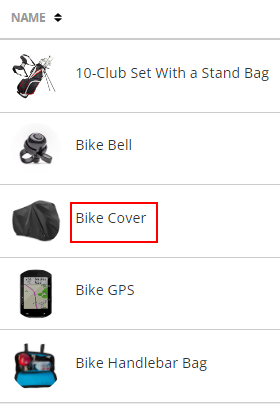
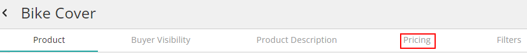
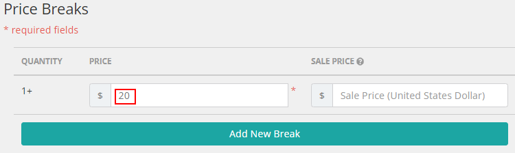
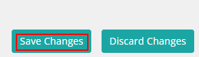
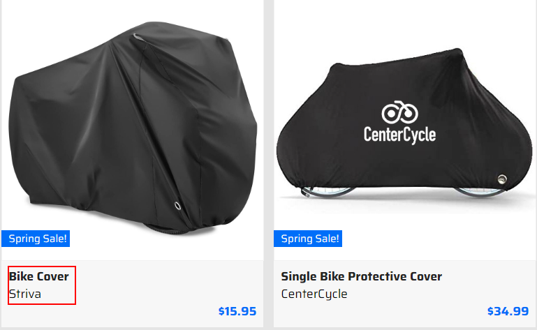
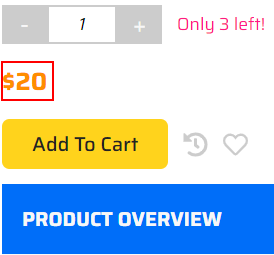

# Updating product details

This scenario shows how to manage products stored in Sitecore OrderCloud platform.

1. Go to your instance details page <https://portal.sitecoredemo.com/instance/{{demoId}}>.

1. Click the "Headstart Seller UI" service.

1. Click the "Products" section.

1. Click "All products" link.

1. Choose any product from the list.

1. Open the "Pricing" section.

1. Change the price in the "Price" field.

1. Scroll down the page and click the "Save Changes" button.

1. Go to the [PLAY! Shop](https://{{demoName}}-{{demoUid}}-shop.vercel.app).
1. Type "bike cover" in the searchbox.

1. Choose the product.

1. You will see the new price of the product.

