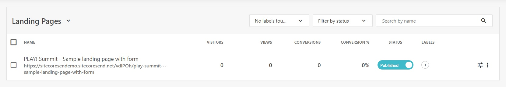
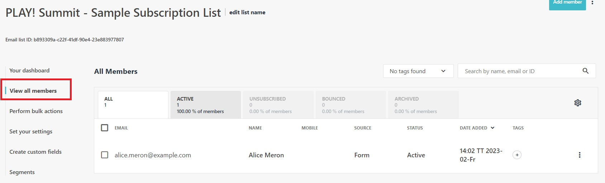

# Landing Pages in Sitecore Send

In this scenario you will examine an existing landing page. The example landing page includes a form that is used to collect marketing contacts and add the contacts to an email list.

## Preview an Existing Landing Page

1. Go to <https://sitecoresendemo.sitecoresend.io/lead-generation/landing-pages/list/1> and click on the landig page named **"PLAY! Summit - Sample landing page with form"**. Ensure the status for the landing page is set to **"Published"**. Review the configuration steps for the landing page to see an example of what needs to be configured.

1. Return to the landing pages listing (Go to <https://sitecoresendemo.sitecoresend.io/lead-generation/landing-pages/list/1>) and click on the vertical elipsis beside the landing page. Click on the **"Preview"** option.

1. Complete and submit the lead generation form on the landing page. If you use a real email, you will receive a follow up email. Alternatively, you can use an fake email for testing purposes.

1. After form submission, the contact will be added to the email list named **"PLAY! Summit - Sample Subscription List"**. Navigate to the email lists (/mailing-lists-new/list/mailing-lists/1) and select **"PLAY! Summit - Sample Subscription List"**. Click on the **"View all members"** option in the left-hand menu to view the contact you added.

This simple example demonstrates how to create a lead generation landing page and how to hook it up to an email list to collect member data.
