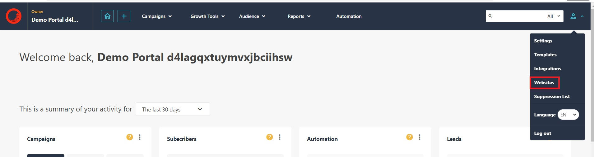
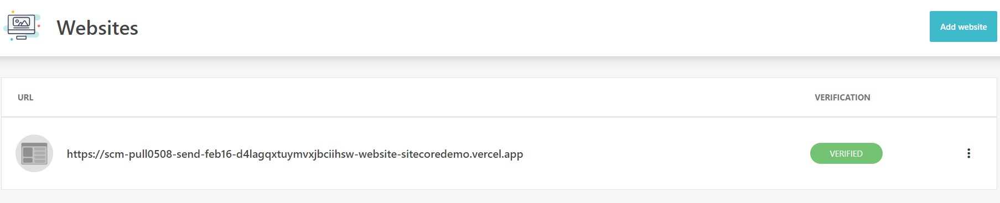
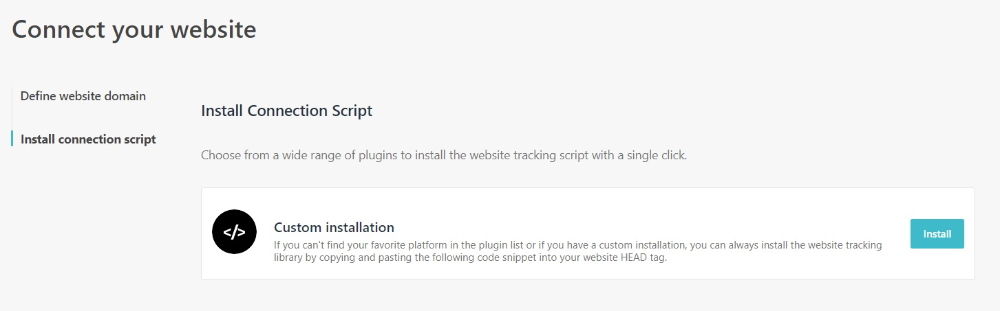
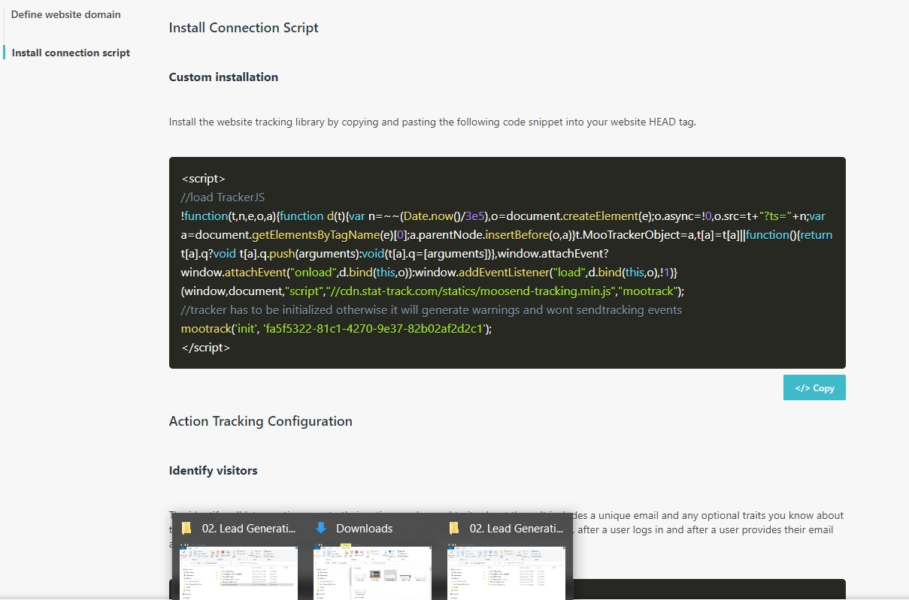

# Integrate With a Website

This scenario will show you how to integrate Sitecore Send with an external website. This integration will perform basic tracking, contact identification, and allow you to add popup forms to the website.

## Add a Website

1. Go to <https://sitecoresendemo.sitecoresend.io/websites> by clicking on **"Websites"** in the account menu.

1. Click **"Add Website"**.

1. In the **"Website domain"** field, enter your domain and click Submit.

## Add the Javascript Tracking Script to Your Website

There are different connection options but the most  copy and add a javascript tracking script to your website.

1. Click on your newly added website.

1. Click on the **"Install connection script"** option in the left-hand menu and then click on the **"Install"** button that appears beside "Custom intallation".

1. Click on the **"<> Copy"** button below the "Custom installation" script. Follow the directions by including this installation script in the HEAD tag of your website. This process will verify the website domain.

Make sure to explore other tracking examples that are displayed beneath the installation tracking script for more examples of what you can do with Sitecore Send integrated with your website.
