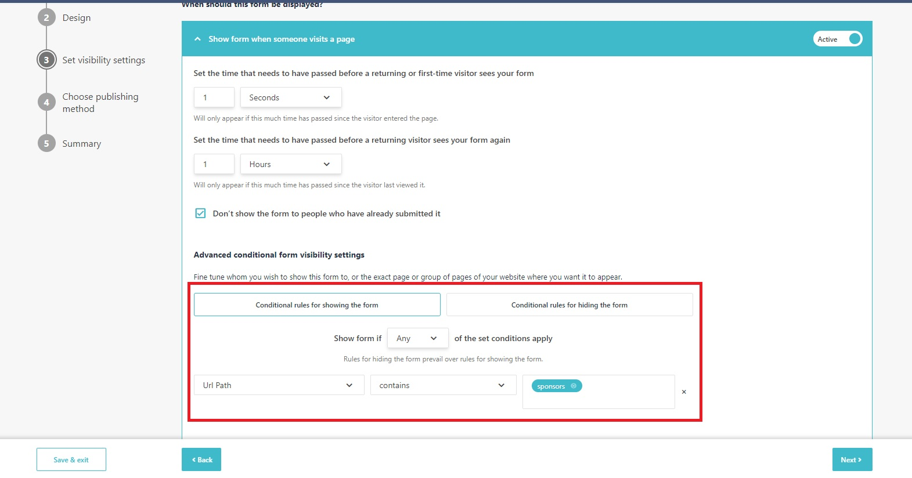
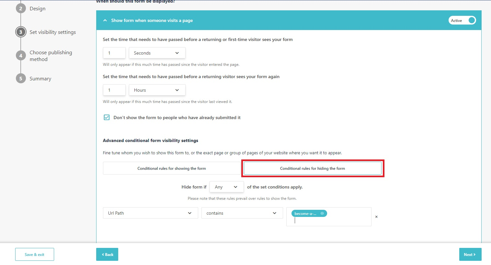
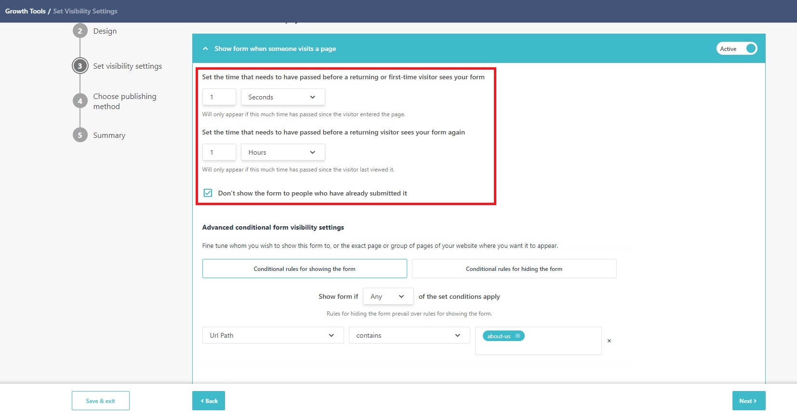
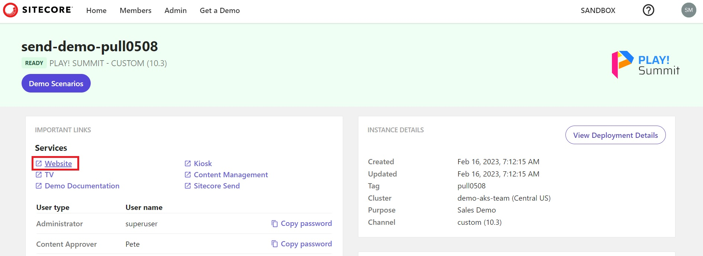
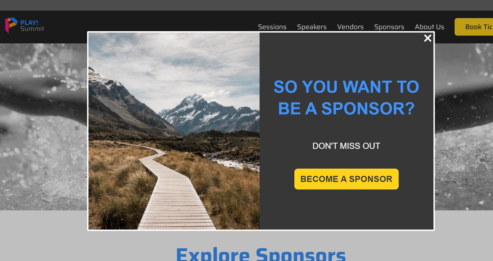
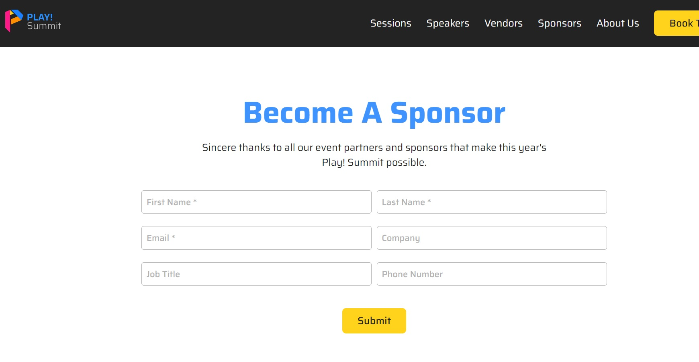

# Popup Call-to-actions

This scenario will examine a pre-configured popup call-to-actions (CTA).

1. Go to  **"Growth Tools"** -> **"Subscription Forms"** <https://sitecoresendemo.sitecoresend.io/campaigns/list/Regular/1> and click on the form named **"PLAY! Summit - Sample popup CTA for website"**.

1. You can review the configuration steps. The **"Set Visibility Settings"** are used to define where and when a popup CTA appears on a connected website. This popup CTA is configured to appear on the website for any pages that include **"sponsors"** in the URL.

1. This popup is also using the **"Conditional rules for hiding the form"** visibility setting.

1. The popup is configured to hide for returning visitors for 1 hour after viewing the popup. For demo purposes, you can open the webpage in incognito mode to always see the popup as a new visitor or you can update the settings so return visitors always see the popup. For example, you can set the time to 1 second and return visitors will always see the popup again.

1. Go to your [demo instance overview page](https://portal.sitecoredemo.com/instance/{{demoId}}) and click on the **"Website"** link.

1. Go to the **"Sponsors"** page on the PLAY! Summit website by clicking on the **"Sponsors"** option in the navigation. You should see the popup CTA appear after a short delay. If you do not see the popup CTA appear, try opening the **"Sponsors"** page in incognito mode in your browser.

1. Click on the **"Become A Sponsor"** button in the popup CTA.

1. The popup CTA will take you to another webpage and help surface important website content.

The purpose of this type of popup is to alert visitors of important areas that you want to highlight.
