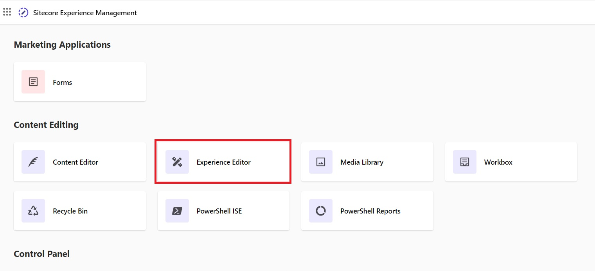
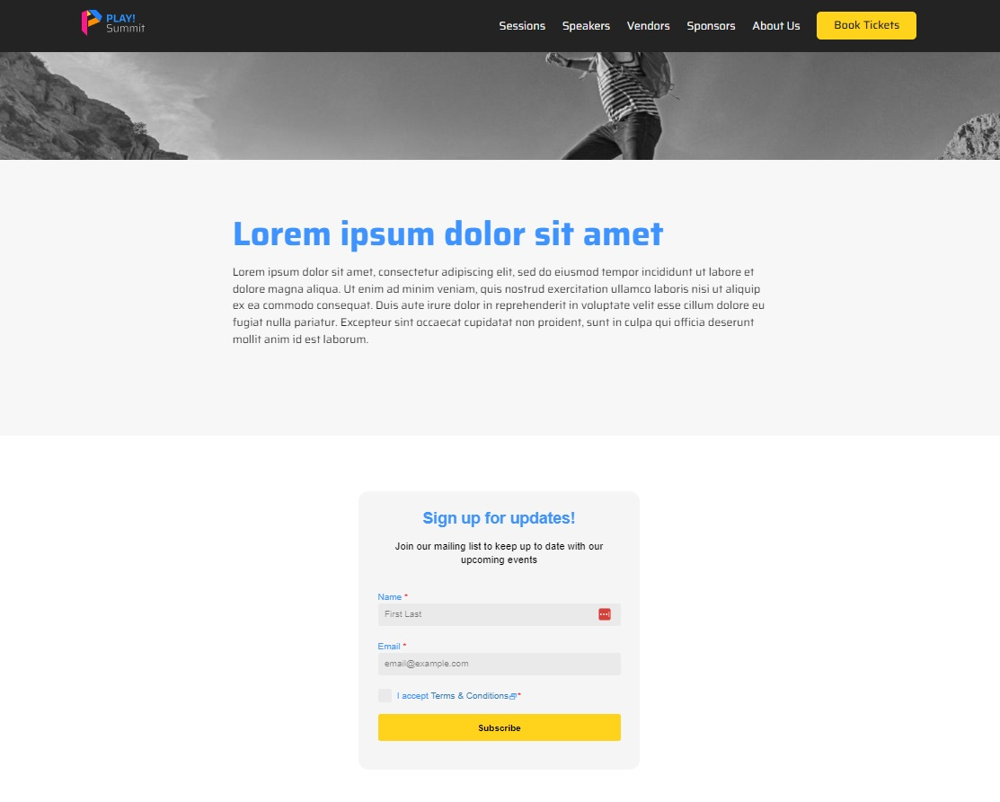

# Embedded Forms

## Adding an Embedded Form to a Landing Page

This scenario will demonstrate how to add a Sitecore Send embedded form to a landing page on the PLAY! Summit demo website.

1. Go to  **"Growth Tools"** -> **"Subscription Forms"** <https://sitecoresendemo.sitecoresend.io/campaigns/list/Regular/1> and click on the form named **"PLAY! Summit - Sample inline form for website"**.

1. Go to the **"Set Visibility Settings"** (step 3) in the left-hand menu and copy the embedded form ID. You can also find the form ID in the browser URL. Save the form ID for **"Step 7"**.

1. Go to your [demo instance overview page](https://portal.sitecoredemo.com/instance/{{demoId}}). Copy the username and password for the **"Administrator"** user. Click on the **"Content Management"** link and log in to Sitecore XM.

1. Click on the  **"Experience Editor"** tile on the Sitecore Launchpad.

1. Navigate to the **"Landing Page with Send Form"** webpage. Click on the hierarchy icon to open up the content tree and navigate under **"Landing Pages"**. Click on **"Landing Page with Send Form"** to open the webpage. Alternatively, you can use the navigation in the ribbon and click the **"Go"** button.

1. Scroll down the landing page and find the area that contains the **"Action required"** text. Click anywhere in the container around the **"Action required"** text to open up the component dialogue. Click on the **"More"** button to expand sub-options and then click on the **"Edit component properties"** button.

1. Fill in the **"Sitecore Send Form ID"** field with the embedded form ID you copied and saved in **"Step 2"**. Click the **"OK"** button to save the field update.

1. Save your changes on the page by clicking on the save icon in the top-left corner of the screen.

1. Expand the Sitecore ribbon (if not already) by clicking on the downward-facing arrow in the top-right corner of the screen.

1. Click on the **"Home"** tab of the Sitecore ribbon and click on the **"Publish"** button to publish your changes to the website.

1. The publish dialogue will appear. You can configure the publish settings as displayed in the screenshot below or any other appropriate configuration.

1. Go to your [demo instance overview page](https://portal.sitecoredemo.com/instance/{{demoId}}) and click on the **"Website"** link to open the PLAY! Summit demo website.

1. Scroll down to the bottom of the PLAY! Summit demo website. Click on the **"Landing Pages"** link in the footer navigation.

1. The available landing pages will be listed. Click on the **"Landing Page with Send Form"** landing page.

1. The landing page will be displayed with the embedded form Sitecore Send. If you do not see the form displayed right away, perform a **"hard refresh"** of the page in the browser to ensure the page is not cached.

Just like the scenario listed above, the same approach can be used to add an embedded form anywhere within the PLAY! Summit demo website. Add the embedded form component named **"EmbedSendForm"** to any PLAY! Summit webpage.
