# Add a Custom Field

This scenario will demonstrate how to add new fields to email lists. The new fields can easily be applied to lead generation forms to help you collect contact information that is important for your business needs

## Add a Field to an Email List

1. Go to <https://sitecoresendemo.sitecoresend.io/mailing-lists-new/list/mailing-lists/1> and click on the email list named **"PLAY! Summit - Sample Subscription List"**.

1. Click on the **"Create custom fields"**option in the left-hand menu and then click on the button named **"Add new custom field"**.
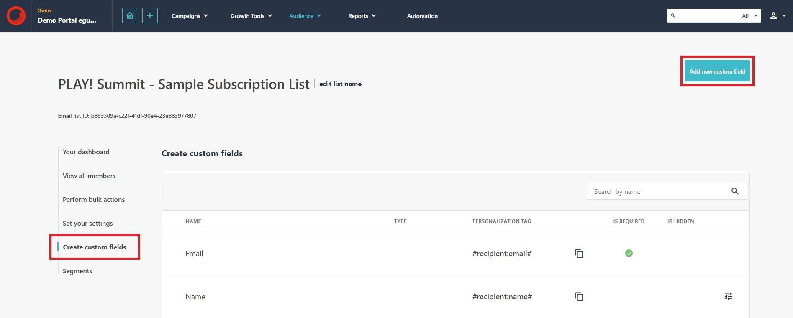

1. Let's create two new custom fields. First, add a custom field named **"Birthday"** that has the Data Type set to **"Date"**.
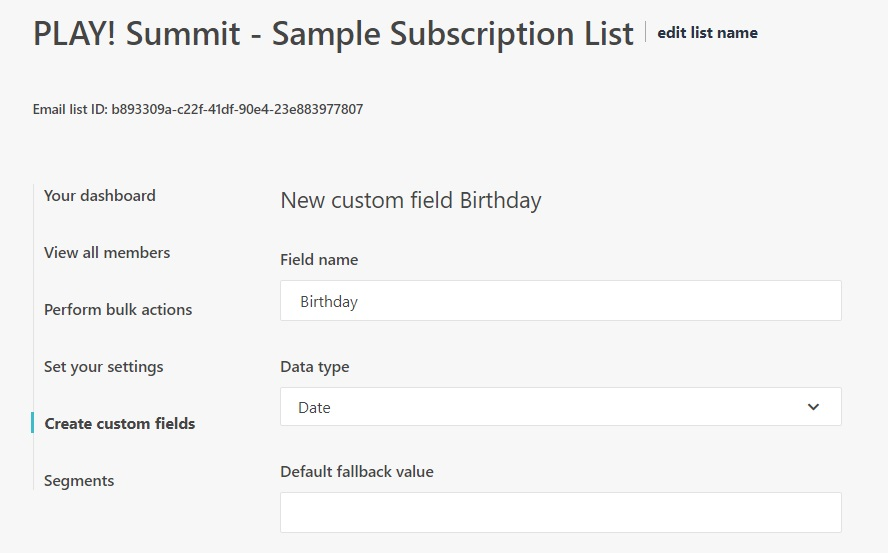

1. Next, add a custom field named **"Job Type"** and has the Data Type set to **"Single Select Dropdown"**. For this type of field, you will need to add dropdown options. You can create your own options or copy the options as shown in the screenshot.
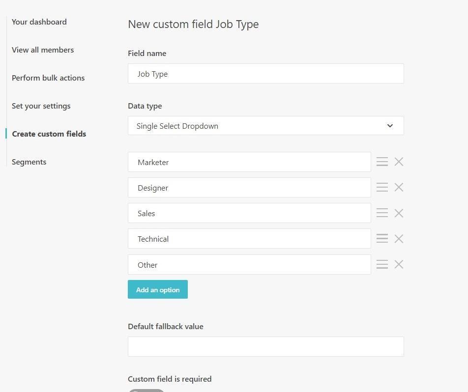

1. You will see your new fields appear in the field listing.
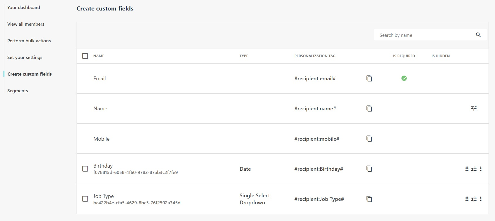

1. Go to the landing page listing (<https://sitecoresendemo.sitecoresend.io/lead-generation/landing-pages/list/1>) and click on the landing page named **"PLAY! Summit - Sample landing page with form"**.

1. Click on step 2 (Design).
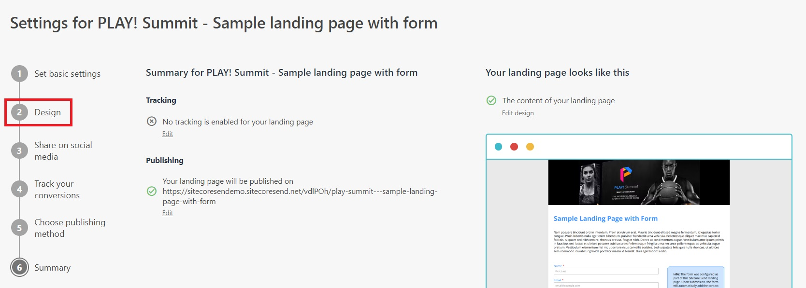

1. Click on the button named (Go to editor).
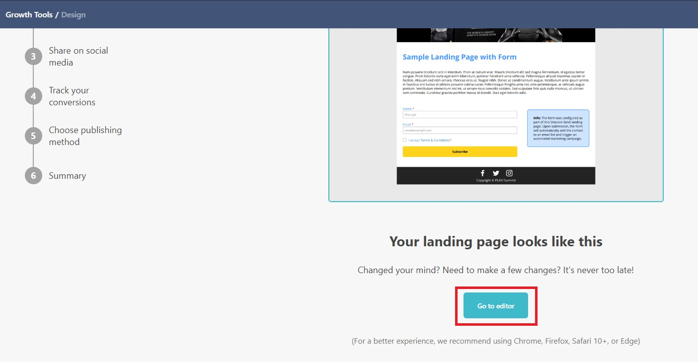

1. Click anywhere within the form on the landing page. A form editing panel will open on the right-hand side of the screen. Click on the **"Edit Custom Fields"** button in the right-hand panel.
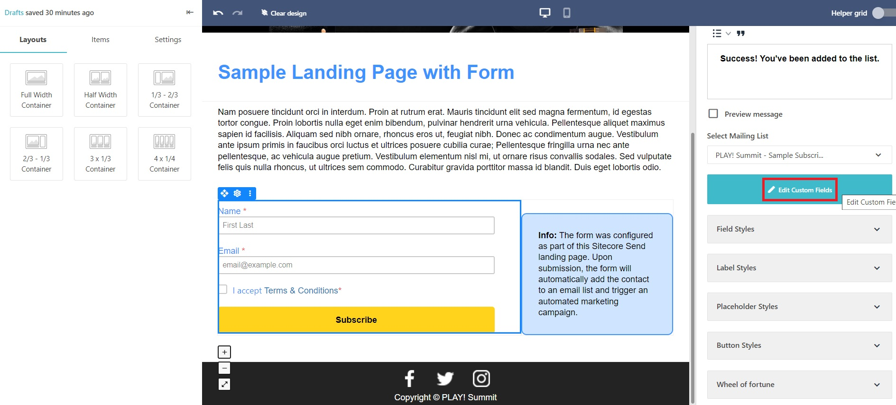

1. The new fields will automatically appear and are available for use. Toggle the **"Use"** button to include the custom fields in the form. You can optionally set custom labels, placeholders, or prefilled values for the form fields. Click on the **"Close"** button when complete.
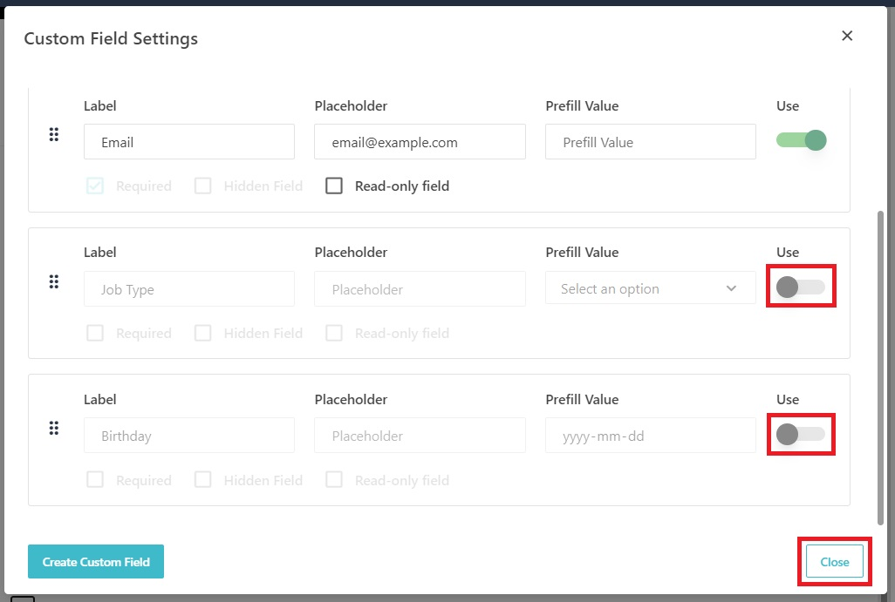

1. Click the **"Proceed to Next Step"** button to save changes to the landing page design.
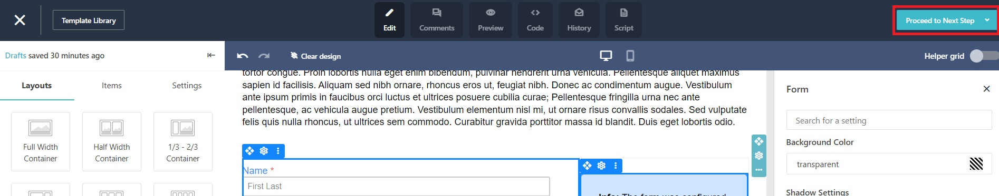

1. Click the **"Save & exit"** button to save changes to save the landing page.
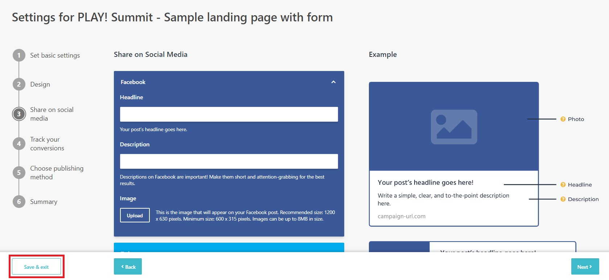

1. Return to the landing page listing (<https://sitecoresendemo.sitecoresend.io/lead-generation/landing-pages/list/1>) and click on the vertical ellipsis beside the landing page. Click on the **"Preview"** option.
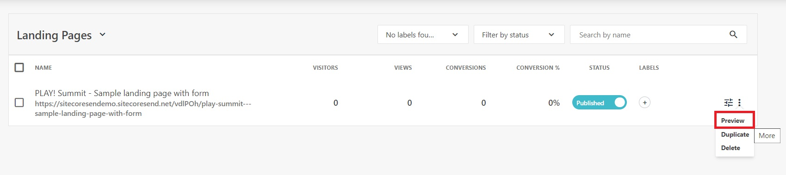

1. You will see your custom fields included in the form. Complete and submit the form.
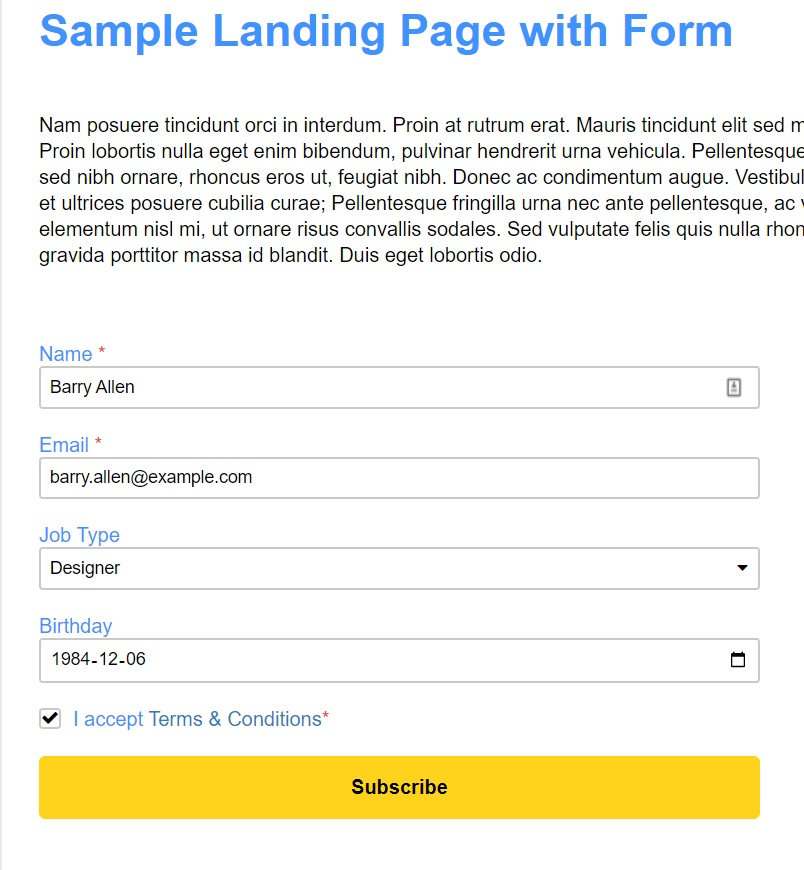

1. After form submission, the contact will be added to the email list named **"PLAY! Summit - Sample Subscription List"** with your custom field data. Navigate to the email lists (<https://sitecoresendemo.sitecoresend.io/mailing-lists-new/list/mailing-lists/1>) and select **"PLAY! Summit - Sample Subscription List"**. Click on the **"View all members"** option in the left-hand menu to view the contact you added.
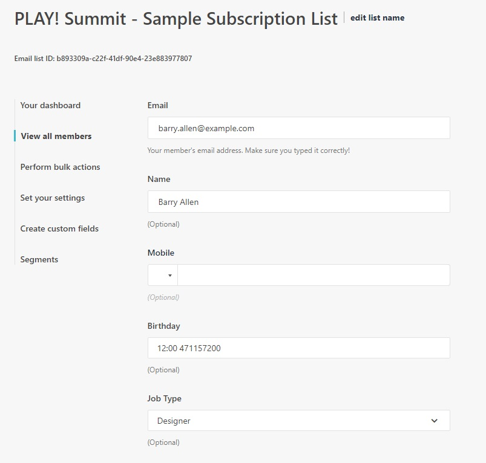

This scenario is an example of how custom fields can be used to collect information about your contacts during lead generation.
