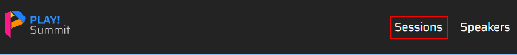
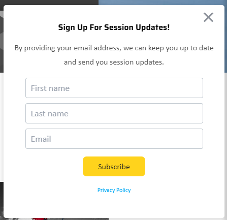
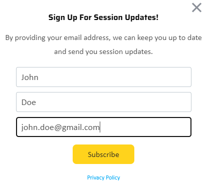
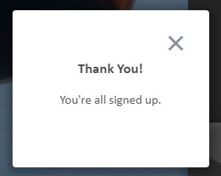

# Subscribe to Email Campaign

This scenario shows how the website visitors can subscribe to your email campaigns.

1. Go to the [PLAY! Summit Website](https://{{demoName}}-{{demoUid}}-website.vercel.app).
1. Open the "Sessions" section.

1. You will see the "Sign Up For Session Updates!" pop-up window.

1. Fill in the "First name", "Last name", "Email" fields and click the "Subscribe" button.

1. You will see the "Thank You" pop-up window.

1. Check your inbox and you will see the "Thank you for signing up to receive updates from PLAY! Summit" email there.

