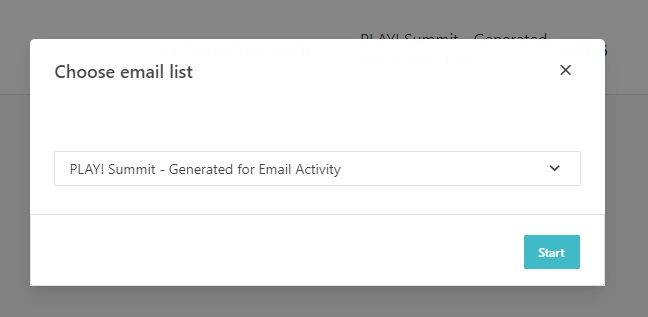
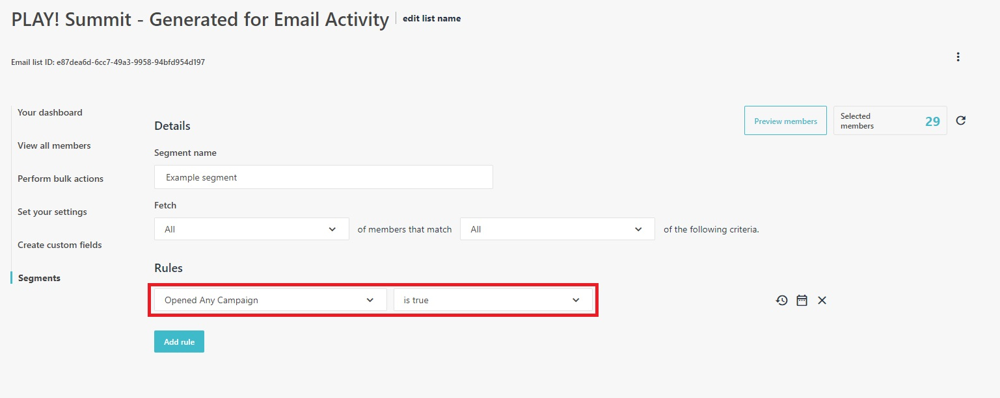
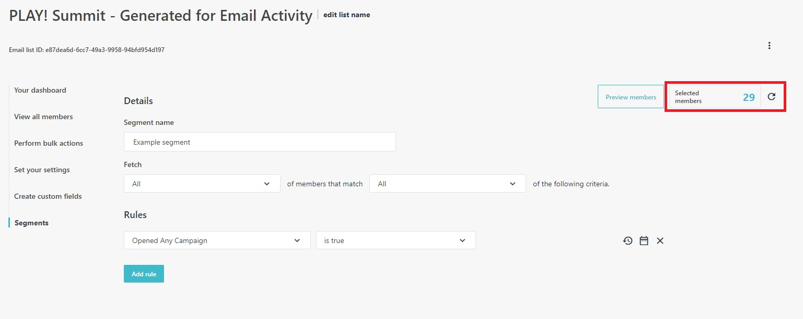
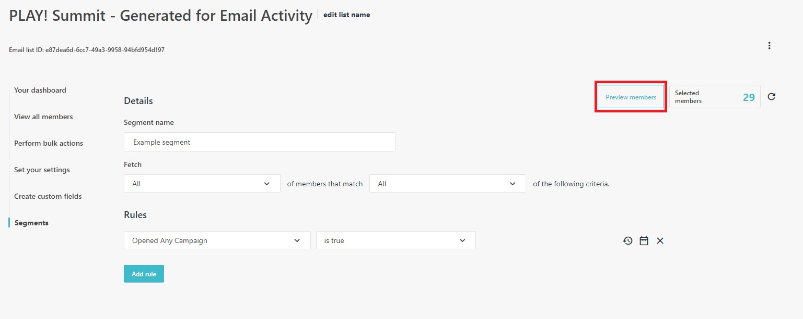
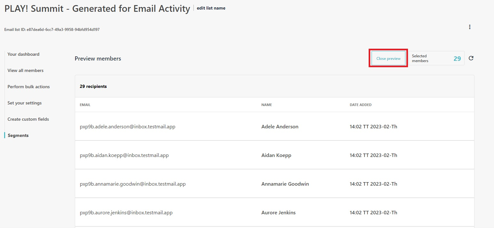

# Create a Segment

This scenario will demonstrate how to create a new segment. You can create a new segment directly from an Email List or go to  **"Audience"** -> **"Segment"** in the navigation. Both approaches will create the same segment which will be listed in both locations.

1. Go to <https://sitecoresendemo.sitecoresend.io/mailing-lists-new/list/segments/1> and click **"New"** -> **"Segment"** in the top right corner.

1. Select an email list for the segment. You can select **"PLAY! Summit - Generated for Email Activity"** as an example that has some campaign activity.

1. You can select an existing template or click the **"Create custom segment"** button to get started.

1. Give the segment a name and explore some of the different segment settings and rules. As an example, select the **"Opened Any Campaign"** rule.

1. Click on the refresh icon to see how many members are captured by the rule(s) you configured.

1. Click the **"Preview members"** button to see the list of members.

1. Click the **"Close members"** button to return to the previous view.

1. Save the segment by clicking on the **"Save segment"** at the bottom of the screen.

Continue to explore the segment rules as you collect more analytics in your Send instance.
