# Creating and sending your first campaign

In this scenario we will create, design and send a regular email campaign using Sitecore Send.

## Logging in to Sitecore Send

1. Go to your instance details page <https://portal.sitecoredemo.com/instance/{{demoId}}>.

1. Copy username from Sitecore Send integration details card.
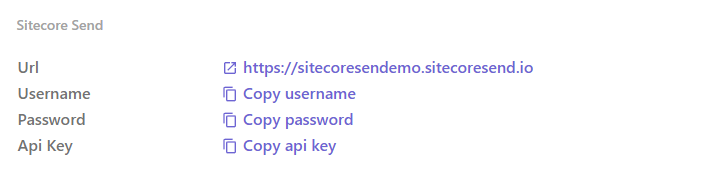

1. Go to [Sitecore Send](https://sitecoresendemo.sitecoresend.io) and login with your username and password.
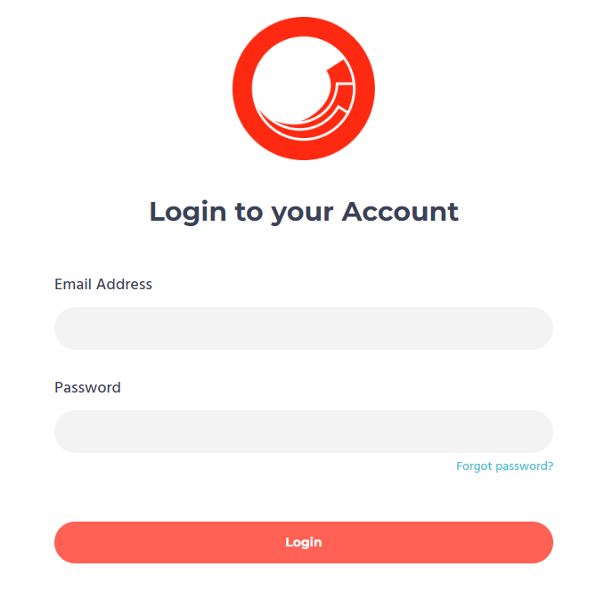

1. You'll see the dashboard with sample campaign and it's statistics.

## Creating an email list

1. Go to <https://sitecoresendemo.sitecoresend.io/mailing-lists-new/list/mailing-lists/1> and click **"New"** -> **"Email List"**.
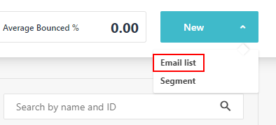

1. Give it a name and click "Create".
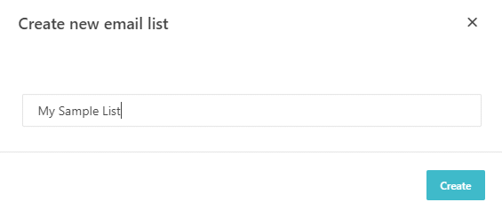

1. Click "Add Member" button in the center of the screen.

1. Enter your email address and don't forget to check the "Consent Confirmation" checkbox.
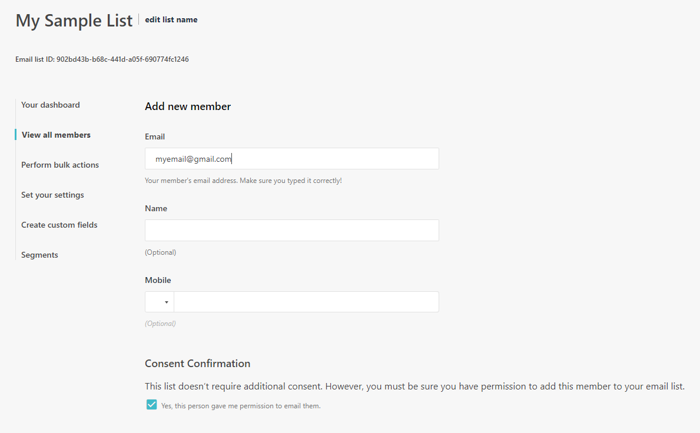

1. Click "Save member" button at the bottom of the screen.

## Creating campaign

1. Go to <https://sitecoresendemo.sitecoresend.io/campaigns/list/Regular/1>.

1. Click **"New"** -> **"Regular"** to create a regular email campaign.

1. Give your campaign a name, subject line, pick a sender from the list and click "Next".
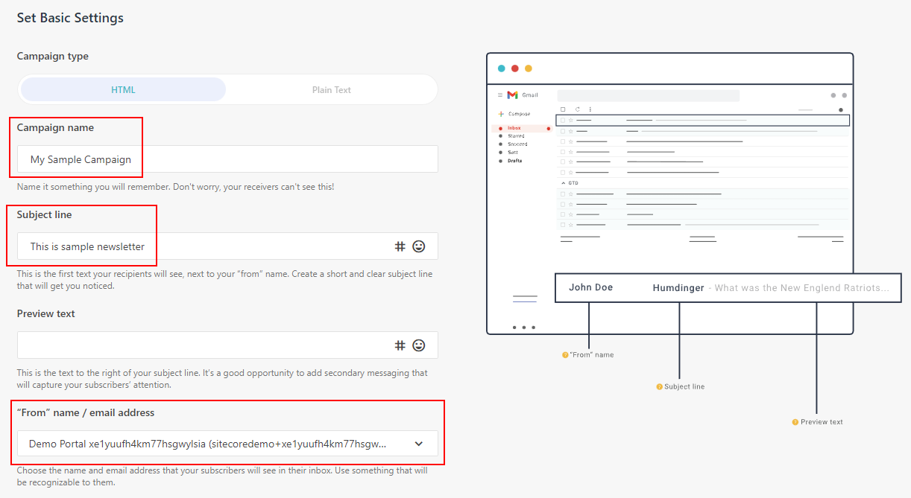

1. Choose and email list and click "Next".
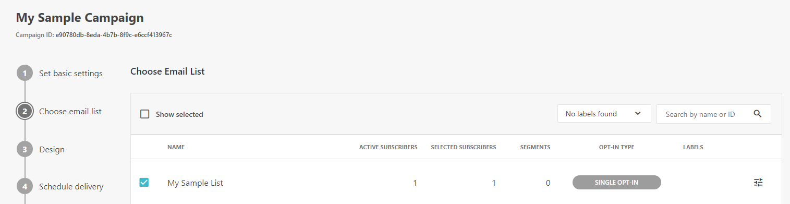

1. Now it's time to get creative! Click "Start designing" and create your own email template or pick and existing one.
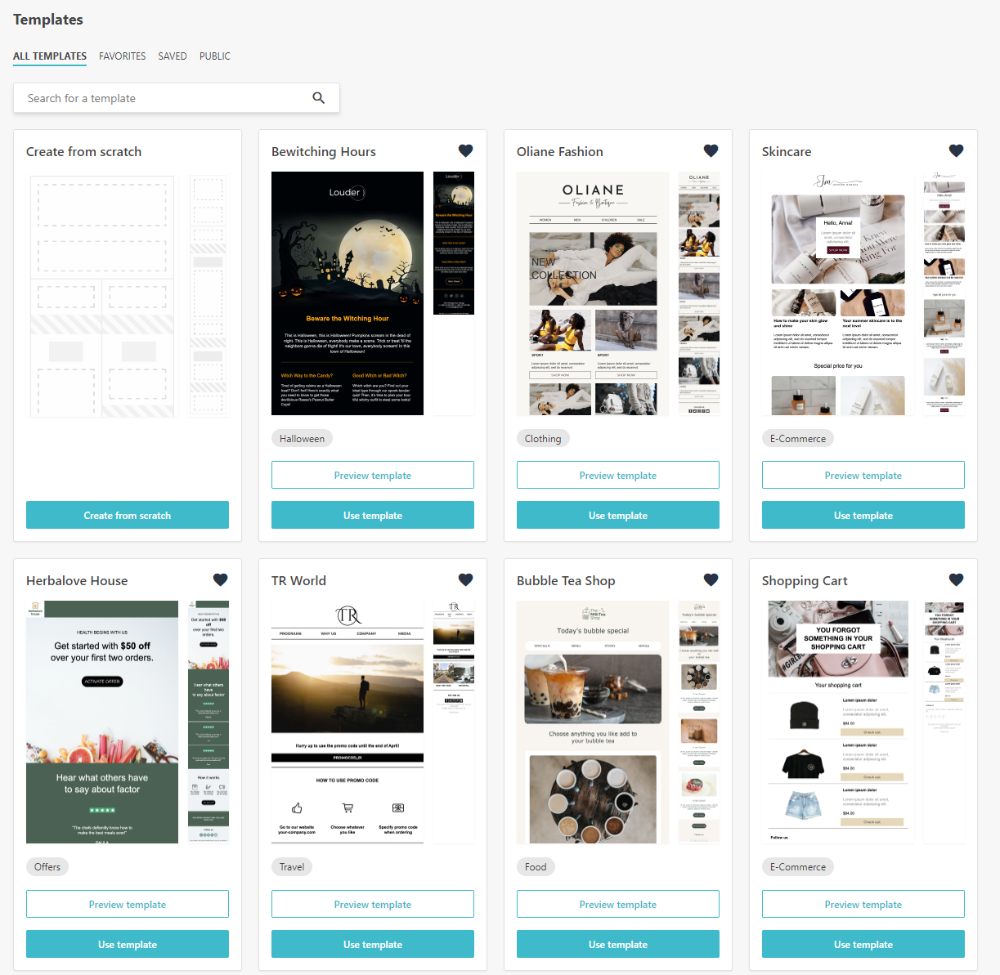

1. When ready, click "Update campaign & continue" at the top right corner of the screen and confirm.
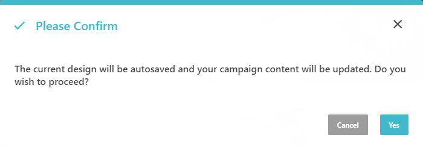

1. At the next screen, you can choose whether to send an email now or schedule delivery, leave the default values and click "Next".
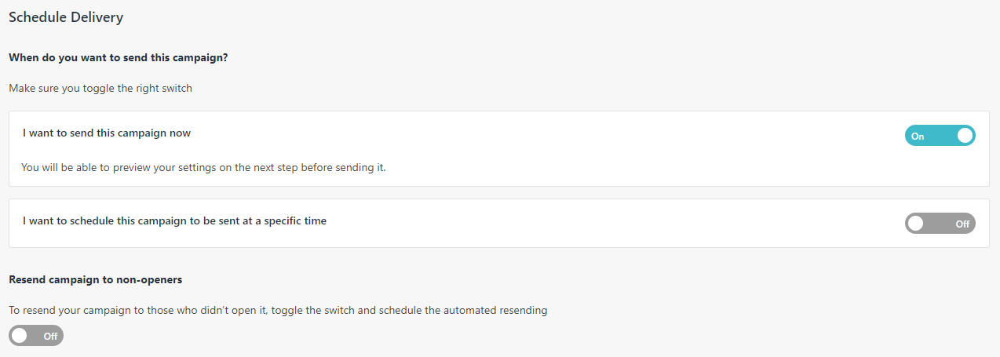

1. Now you're all set - review the settings and send your campaign by clicking "Send" button.
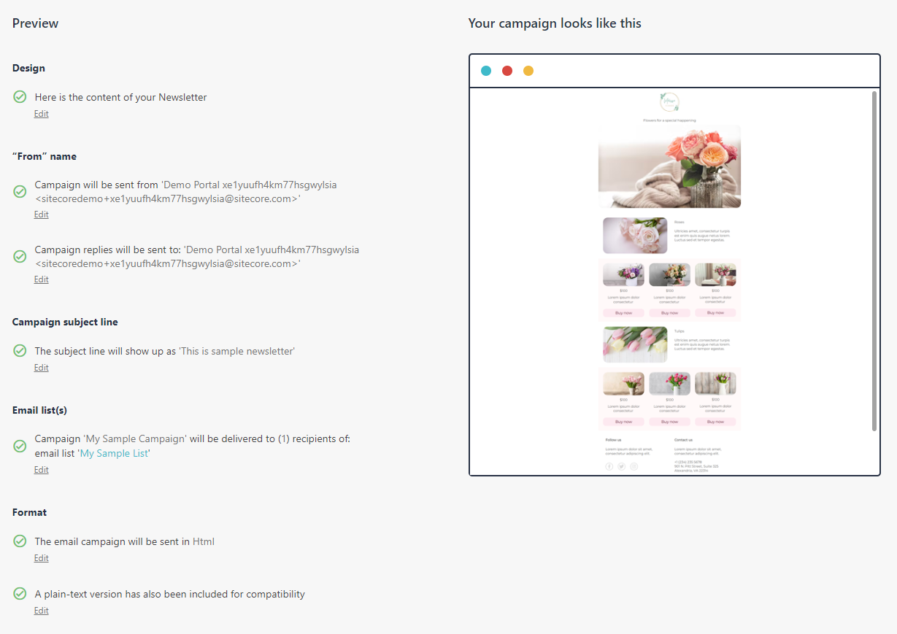

1. You'll see the confirmation screen.
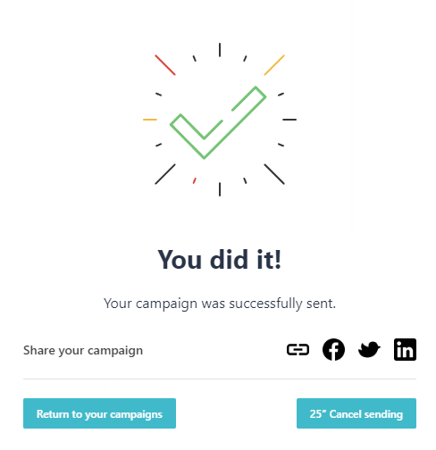

1. Check your email inbox - you'll receive and email shortly.
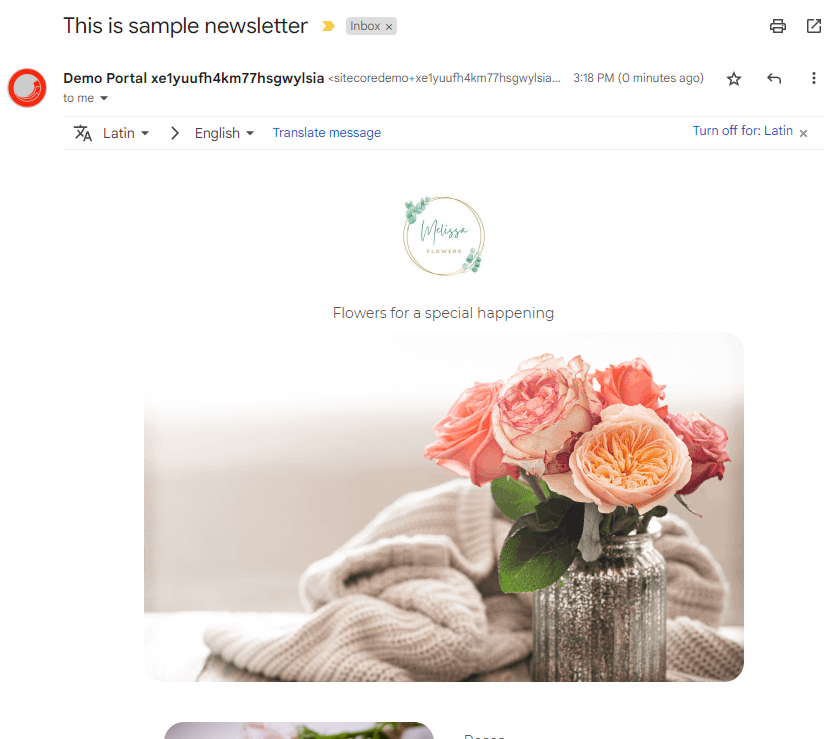
