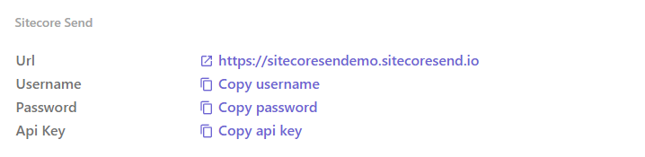
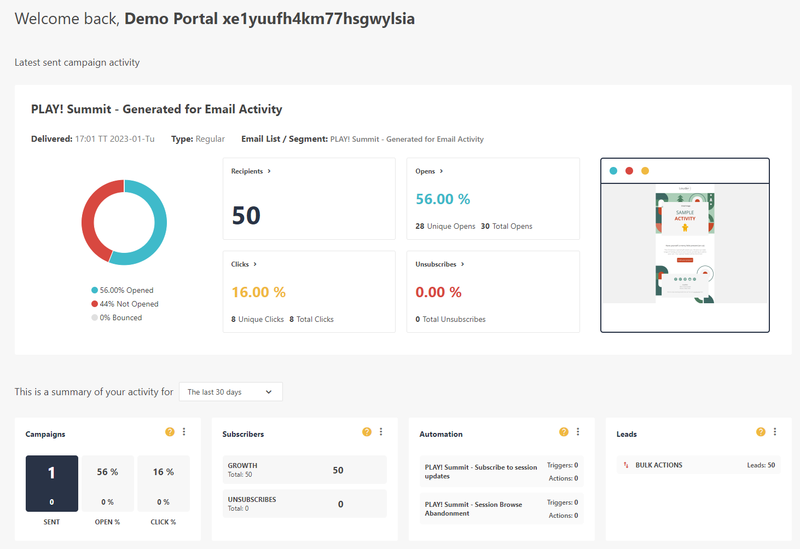

# Sending an AB Testing Campaign

In this scenario you will review and send a pre-configured AB Testing campaign. You will be able to watch the send process which takes between 1-24 hours (configurable) while user data is collected to determine the AB test winner.

## Logging in to Sitecore Send

1. Go to your instance details page <https://portal.sitecoredemo.com/instance/{{demoId}}>.

1. Copy username from Sitecore Send integration details card.

1. Go to [Sitecore Send](https://sitecoresendemo.sitecoresend.io) and login with your username and password.

1. You'll see the dashboard with sample campaign and it's statistics.

## Review the AB Testing Campaign

1. Go to <https://sitecoresendemo.sitecoresend.io/campaigns/list/Regular/1> and click on the campaign named **"PLAY! Summit - Last Chance Offer - AB Test"**.

1. Click on step 1 (Set basic settings). The first setting will determine what type of AB test will be configured. This campaign is configured to run and AB test against the "Subject line" of the email campaign. You can optionally configure the AB test to run against 2 versions of the "Content" or "From name".

1. When running the AB test against the "Subject line" you will see two different subject line fields ("Subject line A" and "Subject line B"). If you switch to running the AB test against "Content" you will see two Design steps in the left hand list of steps.

1. Navigate to step 4 (Set AB Settings) in order to control how the AB test winner will be calculated. You can click & drag the slider to determine how many emails are sent to collect statistics.

1. Next, you can decide if you want email opens or clicks to be used to calculate the AB test winner.

1. Finally, you can decide how long to run data collection process for the AB test. You can set the collection time from 1-24 hours. After the collection time is complete, the remaining emails will be sent with with the AB Test settings that performed best.

1. Navigate to step 6 (Preview) and click the **"Send"** button in the bottom right corner of the screen. After the campign is sent, you will see the AB test campaign is partially sent and waiting for statistics to be collected in order to select the AB Test winner. Wait approximately one minute and refresh the campaign listing page to see the collected statistics. You will need to wait one hour for the AB test to complete and send the remaining emails based on the winning variation.
1. 
