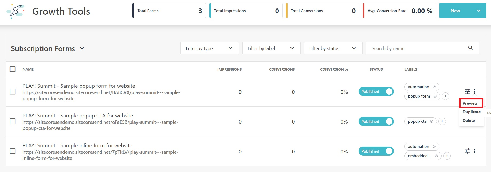
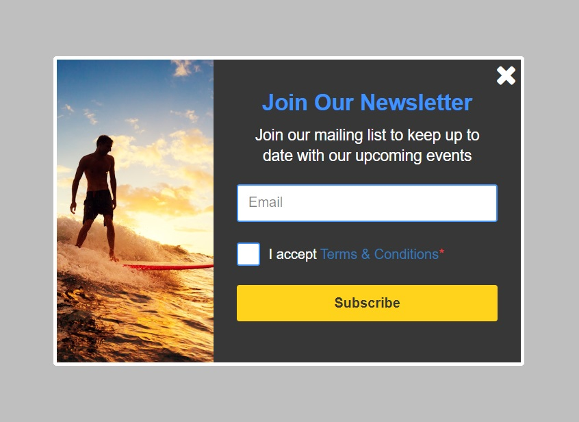

# Popup Forms

This scenario will examine a pre-configured popup form.

1. Go to  **"Growth Tools"** -> **"Subscription Forms"** <https://sitecoresendemo.sitecoresend.io/campaigns/list/Regular/1> and click on the form named **"PLAY! Summit - Sample popup form for website"**.

1. You can review the configuration steps. The **"Set Visibility Settings"** are used to define where and when a popup form appears on a connected website.

1. Click on the **"Save & exit"** button at the bottom of the screen to return to the previous view.

1. Click on the vertical elimpsis beside the form named **"PLAY! Summit - Sample popup form for website"** and click on **"Preview"**.

1. Complete and submit the popoup form.

1. After form submission, the contact will be added to the email list named **"PLAY! Summit - Sample Subscription List"**. Navigate to the email lists (/mailing-lists-new/list/mailing-lists/1) and select **"PLAY! Summit - Sample Subscription List"**. Click on the **"View all members"** option in the left-hand menu to view the contact you added.

