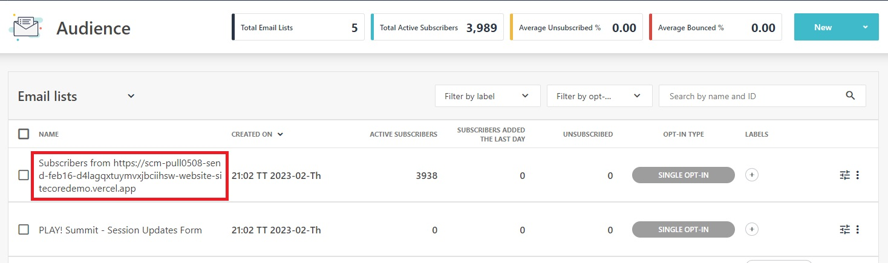
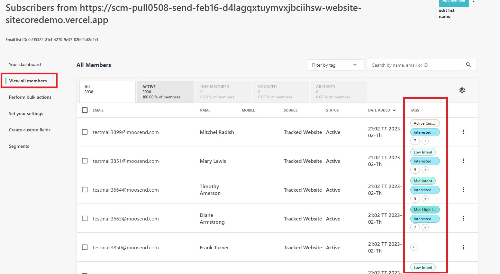
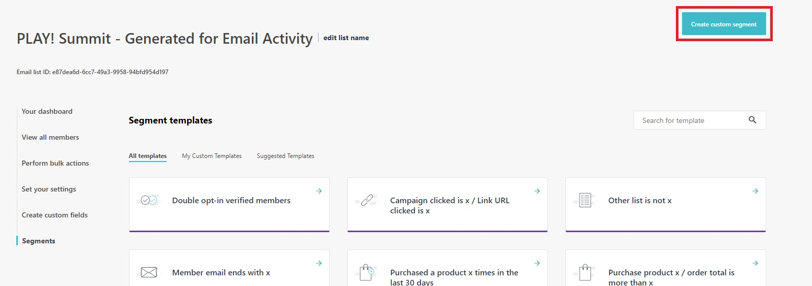
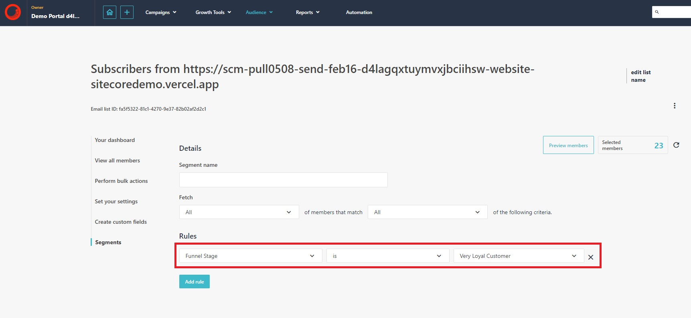
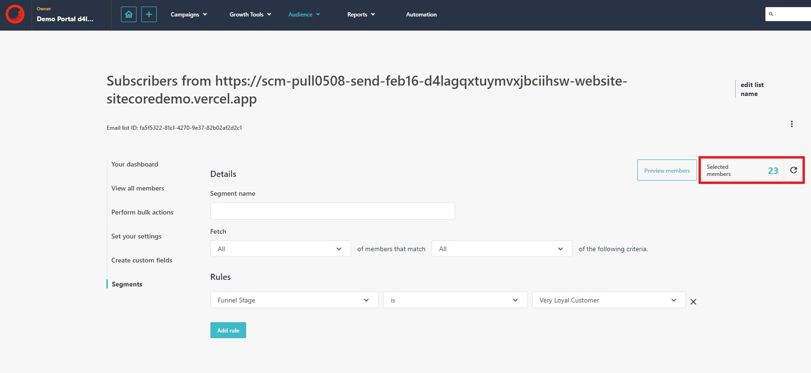

# Member Tags and Audience Discovery Tracking

This scenario will demonstrate how to use the **"Audience Discovery Tracking"** feature. To use this feature, an email list named **"Subscribers from [Your Web App]"** has been created with enough member tags for the AI to process the data.

Audience discovery is a tool within Sitecore Send that supports creating segments to use in campaigns through artificial intelligence and machine learning. It enables you to identify your audiences based on their behavior and preferences and use this information to improve your email marketing campaigns.

The Audience Discovery Tracking has been enabled is enabled for your demo instances of Send. You can find out more about enabling Audience Discovery Tracking from the [documentation](https://doc.sitecore.com/send/en/users/sitecore-send/work-with-audience-discovery.html#enable-or-disable-audience-discovery_body).

1. Go to <https://sitecoresendemo.sitecoresend.io/mailing-lists-new/list/mailing-lists/1> and on the mailing list named  **"Subscribers from [Your Web App]"**.

1. Click on the **"View all members"** option in the left-hand menu and review the list of members that have **"Tags"** added. These tags will be used for audience discovery features.

1. Go to <https://sitecoresendemo.sitecoresend.io/mailing-lists-new/list/segments/1> and click **"New"** -> **"Segment"** in the top right corner.

1. For this scenario you must select the email list named **"Subscribers from [Your Web App]"** that contains members with tags.

1. Click the **"Create custom segment"** button to get started.

1. Give the segment a name and then select the **"Funnel Stage"** rule. You can set the value for the rule to **"Very Loyal Customer"** or select other values.

1. Click on the refresh icon to see how many members are captured by the rule you configured.

You can find out more about built-in segments that are part of the Audience Discovery Tracking feature by reviewing the [documentation](https://doc.sitecore.com/send/en/users/sitecore-send/understanding-audience-discovery.html#built-in-segmentation-criteria_body).
